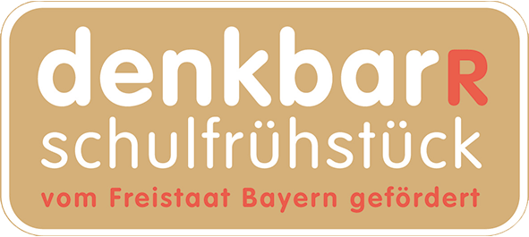

+++
title = "Frühstücksinitiative denkbar-R der BLLV-Kinderhilfe e.V."
date = 2021-03-23
[taxonomies]
tags = ["schulfruehstueck" ,"schulleben" ]
+++

Für einige Kinder ist es nicht selbstverständlich, morgens gemeinsam mit der Familie den Tag mit einem Frühstück zu beginnen. Oft fehlt die Zeit, die Eltern müssen morgens sehr früh in die Arbeit oder auch der Schulbus fährt schon früh am Morgen. Auch das Geld für ein gesundes Frühstück ist oft knapp. Doch zum Start in einen erfolgreichen Schultag gehört ein gesundes Frühstück, das die leeren Energiereserven auffüllt und hilft, konzentriert und erfolgreich zu lernen. Auch Studien belegen den direkten Zusammenhang zwischen schulischer Leistung und einem ausgewogenen Frühstück.   

Dank der Frühstücksinitiative denkbar-R der BLLV-Kinderhilfe e.V. erhalten an der …. Schule … Kinder, die zu Hause nicht frühstücken können, ein kostenloses gesundes Schulfrühstück. Unser/e Frühstückslotse/in …..ist jeden Morgen für unsere Kinder da und bereitet ein leckeres Frühstück zu. Die Kinder werden nicht nur mit wertvollen Nährstoffen versorgt, die ihnen helfen, sich zu konzentrieren und den Tag kraftvoll zu starten. Durch das Miteinander und die Fürsorge erfahren die Kinder auch Geborgenheit und ein Gemeinschaftsgefühl. Das gibt ihnen Sicherheit und stärkt ihr Selbstvertrauen. Die Kinder können sich untereinander austauschen. Die Frühstückslotsen sind dabei nicht nur Frühstückshelfer sondern wichtige Bezugspersonen.

Gefördert wird das betreute Frühstück denkbar-R seit 2014 vom Bayerischen Staatsministerium für Familie, Arbeit und Soziales, beraten und unterstützt werden die Schulen durch die Initiative denkbar-R Schulfrühstück der BLLV-Kinderhilfe e.V.

Weitere Informationen zum Frühstücksprojekt denkbar-R finden Sie unter [www.denkbar.bllv.de](http://www.denkbar.bllv.de)

