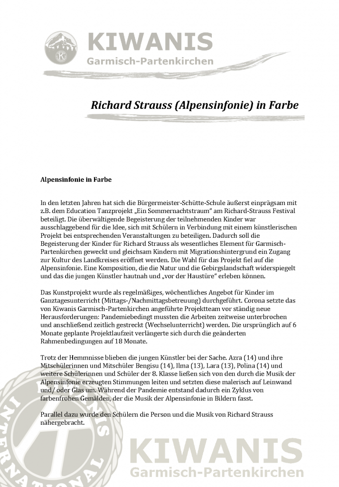

+++
title = "Kunstprojekt 8G \"Kultur macht stark\""
date = 2021-06-07
[taxonomie]
tags = ["kultur-macht-stark-projekte" ,"archiv" ,"mittelschulaktivitaeten" ]
+++

> Pressemitteilung – KIWANIS Garmisch-Partenkirchen

# Richard Strauss (Alpensinfonie) in Farbe

Zum öffnen anklicken

### **Alpensinfonie in Farbe**

In den letzten Jahren hat sich die Bürgermeister-Schütte-Schule äußerst einprägsam mit z.B. dem Education Tanzprojekt „Ein Sommernachtstraum“ am Richard-Strauss Festival beteiligt. Die überwältigende Begeisterung der teilnehmenden Kinder war ausschlaggebend für die Idee, sich mit Schülern in Verbindung mit einem künstlerischen Projekt bei entsprechenden Veranstaltungen zu beteiligen. Dadurch soll die Begeisterung der Kinder für Richard Strauss als wesentliches Element für Garmisch-Partenkirchen geweckt und gleichsam Kindern mit Migrationshintergrund ein Zugang zur Kultur des Landkreises eröffnet werden. Die Wahl für das Projekt fiel auf die Alpensinfonie. Eine Komposition, die die Natur und die Gebirgslandschaft widerspiegelt und das die jungen Künstler hautnah und „vor der Haustüre“ erleben können.

Das Kunstprojekt wurde als regelmäßiges, wöchentliches Angebot für Kinder im Ganztagesunterricht (Mittags-/Nachmittagsbetreuung) durchgeführt. Corona setzte das von Kiwanis Garmisch-Partenkirchen angeführte Projektteam vor ständig neue Herausforderungen: Pandemiebedingt mussten  die  Arbeiten  zeitweise  unterbrochen und anschließend zeitlich gestreckt (Wechselunterricht) werden. Die ursprünglich auf 6 Monate geplante Projektlaufzeit verlängerte sich durch die geänderten Rahmenbedingungen auf 18 Monate.

\[Best\_Wordpress\_Gallery id="11" gal\_title="Alpensinfonie"\]

Trotz der Hemmnisse blieben die jungen Künstler bei der Sache. Azra (14) und ihre Mitschülerinnen und Mitschüler Bengisu (14), Ilma (13), Lara (13), Polina (14) und weitere Schüler:innen der 8. Klasse ließen sich von den durch die Musik der Alpensinfonie erzeugten Stimmungen leiten und setzten diese malerisch auf Leinwand und/ oder Glas um. Während der Pandemie entstand dadurch ein Zyklus von farbenfrohen Gemälden, der die Musik der Alpensinfonie in Bildern fasst.

Parallel dazu wurde den Schülern die Person und die Musik von Richard Strauss nähergebracht.

Die Realisierung des Projektes wurde durch eine intensive Zusammenarbeit zwischen der Bürgermeister-Schütte-Schule, dem Kiwanis Club Garmisch-Partenkirchen und dem Richard Strauss Institut möglich.

Gefördert wurde das Projekt durch das Programm „Kultur macht stark“ des

Bundesministeriums für Bildung und Forschung mit dem Projektpartner „Paritätisches Bildungswerk Bundesverband“, der Marktgemeinde Garmisch-Partenkirchen\* und durch eine großzügige finanzielle Unterstützung des Kiwanis Clubs Garmisch-Partenkirchen e.V..

Die künstlerische Anleitung der Gruppe erfolgte durch die Krüner Künstlerin Manuela Dilly. Alle weiteren organisatorischen und administrativen Aufgaben bei der Abwicklung des Projektes wurden durch den Kiwanis Club Garmisch-Partenkirchen erbracht.

Am 24. Juni stellen die jungen Künstler ihre Werke der Öffentlichkeit vor und können während der Richard Strauss Tage im Foyer des Musiksaals besichtigt werden.

\* Förderzusage der Marktgemeinde steht noch aus
