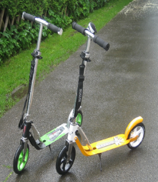
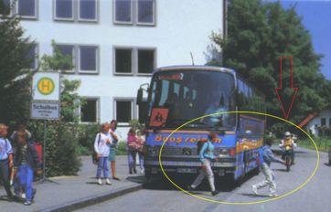
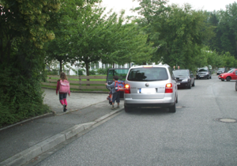

+++
title = "Sicher zur Schule"
date = 2021-06-28
[taxonomies]
tags = ["infos-zum-schulanfang" ]
+++

- _**Trainieren Sie bitte mit Ihrem Kind den Schulweg!**_
- Kinder sollten in der ersten Zeit einen festgelegten Schulweg gehen.
- Trainieren Sie bitte das Überqueren der Straße! (Zuerst nach links schauen, dann nach rechts und zur Kontrolle noch einmal nach links. Wenn FREI ist darf man gehen…)
- Verhalten an Ampel, Zebrastreifen und
- Schülerlotsenübergängen

  
**Radfahren:**

- In den ersten Schuljahren sollte das Fahrrad zuhause bleiben.
- Bis zu einem Alter von ca. 10 Jahren sind Kinder im Straßenverkehr noch völlig überfordert, obwohl sie ihr Fahrrad vielleicht schon beherrschen.
- Lassen Sie Ihr Kind frühestens mit dem Abschluss der Fahrradausbildung in der 4. Klasse mit dem Fahrrad zur Schule fahren.      

**Roller:**

- Rollerfahrer = Fußgänger
- _**Rollern auf dem Gehweg mit Warnweste und Helm!**_
- Trauen Sie Ihrem Kind zu mit dem Roller zur Schule zu fahren?
- Rücksicht auf „richtige“ Fußgänger!
- Vorsicht bei Hindernissen (Steine, Split, Risse)!

  
**Schulweg mit dem Bus:**

- Nicht vor oder hinter dem Bus die Fahrbahn überqueren, sondern erst wenn der Bus weg ist! 
- Kein Drängeln oder Schubsen!
- Ruhe im Bus!
- Schicken Sie Ihr Kind immer so rechtzeitig auf den Weg, dass auch Verspätungen mit öffentlichen Verkehrsmitteln mit einkalkuliert sind.

  
**Schulweg mit dem Auto:**

- _**Kindersicherungspflicht seit dem 01.04.93**_
- Gewöhnen Sie Ihrem Kind an, immer auf der Fahrbahn abgewandten Seite ein- und auszusteigen!
- Vorsicht in Schulgegenden: Fahren Sie langsam und aufmerksam, um Kinder, die zu Fuß oder per Fahrrad kommen, nicht zu gefährden und auf spontane Aktionen reagieren zu können!

  
**Verdächtiges Ansprechen von Kindern:**

- Schulwegtraining („Rettungsinseln“, Abstand zu Pkw)
- Keine Auskunft geben oder Geschenke annehmen!
- Schreien / Wehren (Über 80 % der Täter lassen ab. Täter mit „SIE“ ansprechen.)
- „Miteinander reden“ schafft Vertrauen.
- Notrufnummern 110 und 112

Inhalte und Bilder entnommen aus der PP „Informationen für Eltern von Schulanfängern“ PI GAP
