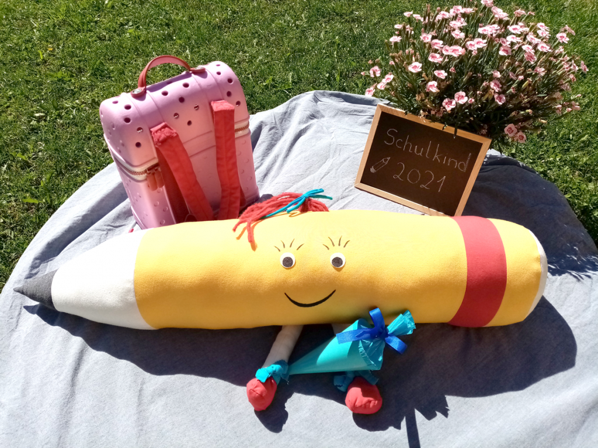

+++
title = "Fine mit der Mine Teil 10"
date = 2021-07-06
[taxonomies]
tags = ["vorschulprojekt" ]
+++

# „Besuch in der Schule“

Hallo liebes Vorschulkind!

Schön, dass du heute wieder vorbeischaust!  
Ich bin schon ganz aufgeregt!  
Warum, fragst du? Na, vielleicht kannst du es dir sogar schon denken. Morgen bekommen wir ganz viel Besuch! Ob ich Geburtstag habe, fragst du?  
Nein, Geburtstag habe ich nicht, aber ich freue mich genau so sehr, als wenn es mein Geburtstag wäre!

Morgen dürfen alle Kinder, die im September zu uns in die Schule kommen, schon einmal bei uns vorbeischauen, sich den Schulhof und die Klassenräume ansehen und hineinschnuppern, wie es ist, ein Schulkind zu sein. Die Mamas und Papas können Fragen an die Lehrerinnen und Lehrer stellen und erfahren, wie es für dich als Schulkind im September los geht. Und ich darf euch endlich persönlich kennenlernen! Ich freue mich schon riesig!

Ich bin gespannt, ob du mich morgen im Schulhaus entdeckst! Ich habe auf jeden Fall schon meinen Schulranzen gepackt und kann es kaum erwarten!

Vielleicht hast du ja Lust, mir ein kleines Bild zu malen, das du mir morgen mitbringen möchtest. Ich würde mich sehr über Post von dir freuen! Meinen Briefkasten findest du im Eingangsbereich des Stockwerksbaus.

Dort werde ich dich auch begrüßen!

Im Schulhaus habe ich noch etwas versteckt…  
Schaue doch mal, ob du hier oder dort eine kleine Find entdecken kannst? Wenn du sie findest, darfst du sie natürlich als Andenken mitnehmen!

Ich freue mich schon auf morgen!  
Bis dahin liebe Grüße von deiner Fine!
