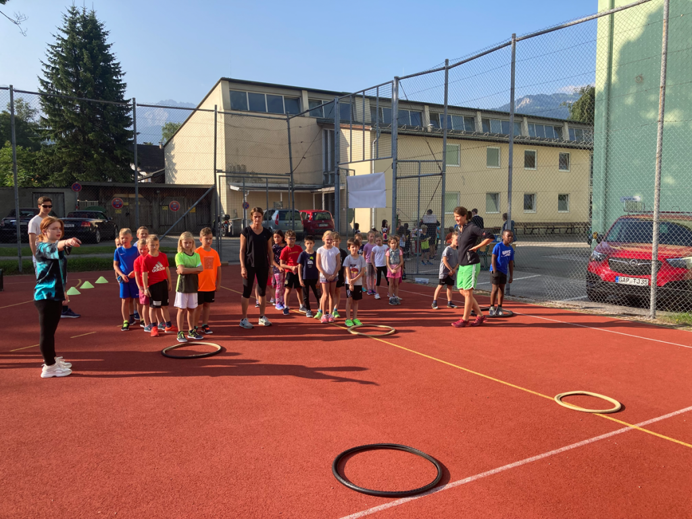
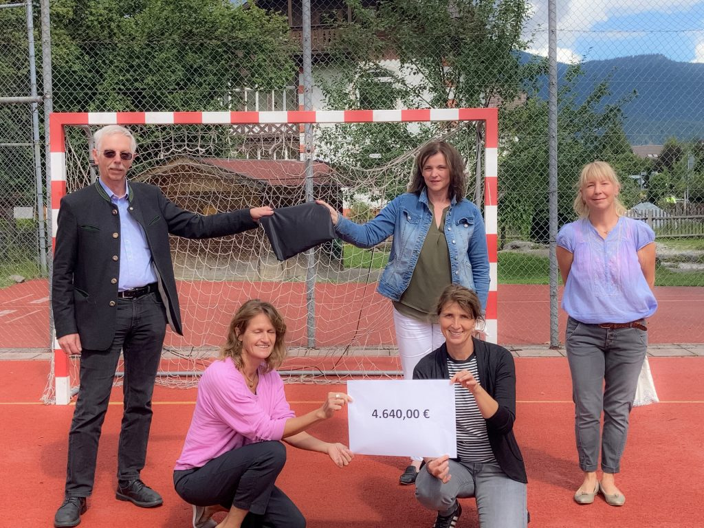

+++
title = "Laufen für bedürftige Kinder und Flutopfer"
date = 2021-08-02
[taxonomies]
tags = ["archiv" ,"grundschulaktivitaeten" ]
+++

## **Grundschüler\*innen der Bürgermeister-Schütte-Grundschule sammeln über 4600 Euro bei Sportaktion**

Der Spendenlauf der Bürgermeister-Schütte-Grundschule am 22.07.2021 stellte sich als voller Erfolg heraus. Die 331 Teilnehmer\*innen liefen insgesamt ca. 550 km und erzielten dabei einen nicht erwarteten Spendenbetrag von 4640 Euro.

Die Idee der Schulleitung und des Sportteams der Bürgermeister-Schütte-Schule ist einfach: Alle Grundschulklassen machten sich zugunsten bedürftiger Kinder im Landkreis und der Flutopfer, die in Not geraten sind, gemeinsam auf den Weg. Am Lauftag durchliefen die Kinder klassenweise gemeinsam je 15 Minuten lang einen Vielseitigkeitsparcours am Sportplatz und eine insgesamt 400 Meter Laufstrecke um das Schulhaus – so oft sie konnten.

Sponsoren, die zuvor von jedem (r) einzelnen Teilnehmer\*in im Familien- und Freundeskreis gesucht wurden, belohnten dann jeden im Sinne der guten Sache zurückgelegten Kilometer mit einer Spende. Über die Höhe und den Gesamtumfang des gespendeten Betrages konnte dabei jeder Geldgeber selbst bestimmen.

Die Kinder legten eine erstaunliche Motivation an den Tag. In der Verpflegungszone hatten die Teilnehmer\*innen bei optimalem Laufwetter mit Temperaturen um die 20 Grad Runde für Runde die Gelegenheit, sich mit Getränken und Schulobst zu stärken. Mit den gesammelten Geldern ist die Grundschule nun in der glücklichen Lage, bedürftigen Kindern und Flutopfern unter die Arme greifen zu können. Die Verantwortlichen der Bürgermeister-Schütte-Grundschule Garmisch-Partenkirchen bedanken sich bei allen helfenden Lehrkräften und Mittelschüler\*innen, Läufern und Sponsoren für deren Unterstützung, Leistung und Spendenbereitschaft.

