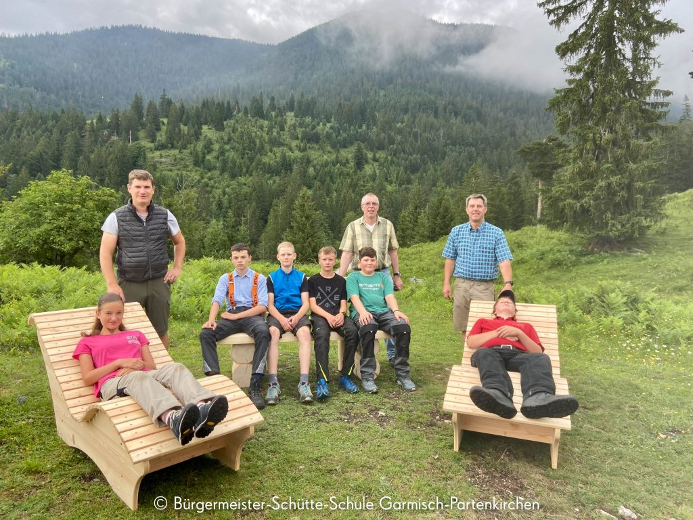
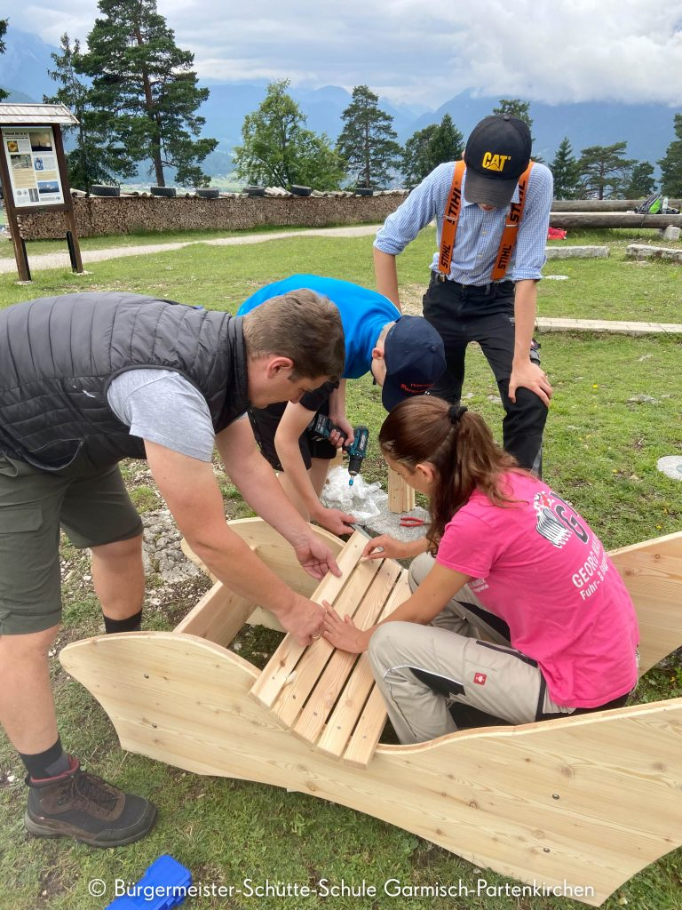

+++
title = "Sonnenliegen für’n Sunnaweg"
date = 2021-08-09
[taxonomies]
tags = ["archiv" ,"mittelschulaktivitaeten" ]
+++

„Wir wünschen allen erholsame Stunden auf unseren Liegen“, war der Konsens der SchülerInnen der Klasse 7a der Bürgermeister-Schütte-Schule. Vor kurzem waren sie mit der Konrektorin Sonja Ermer, dem Lehrer Thomas Härter und dem Fachlehrer Ludwig Geiger sowie dem Schreiner Anton Grünauer aus Oberau hinauf zum Hasenböderl am Wank gewandert.

Oberhalb der Hängebrücke zur Tannenhütte am Sunnaweg gelegen, befindet sich bereits ein grünes Klassenzimmer und eine Sonnenuhr, welche in der Vergangenheit von SchülerInnen der Bürgermeister-Schütte-Schule unter Mitarbeit von Dr. Richard Knoche (Agenda 21) errichtet wurden.

In diesem Jahr war es endlich wieder möglich mit externen Partnern zu kooperieren. Die Schreinerei Anton Grünauer aus Oberau erklärte sich sofort bereit am Projekt „Praxis an Mittelschulen“, welches durch Fördermittel der Regierung von Oberbayern ermöglicht wird, mitzuwirken. So durften die SchülerInnen mehrmals in der Werkstatt den Schreiner unterstützen und handwerkliche Erfahrungen machen.

Es entstanden zwei Sonnenliegen und eine Holzbank, die dann am Hasenböderl gemeinsam zusammengebaut und aufgestellt wurden.

Stolz präsentierten die Kinder ihre Werke vor den Gästen. Die SchülerInnen hoffen, dass sich „die Wanderer nach einem beschwerlichen Aufstieg erholen können!“

Konrektorin Sonja Ermer bedankte sich bei allen Beteiligten und wünscht sich diesen Ort als einen Ruhepol für alle Ausflügler: **„Die Natur bedarf keiner Erläuterung; um ihre Schönheit zu verstehen, genügt ein offener Blick und ein empfängliches Gemüt.“** (Karl Detlef)
