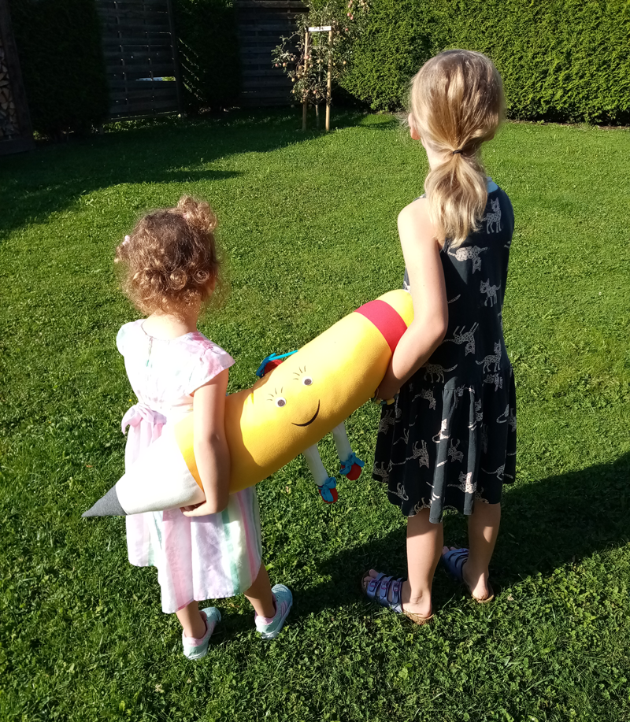

+++
title = "Fine mit der Mine Teil 11"
date = 2021-09-06
[taxonomies]
tags = ["Fine mit der Mine" ]
+++

# „Mein Weg zur Schule“

Hallo liebes Vorschulkind!

Jetzt haben wir uns schon wieder eine Weile nicht gehört. Ich hoffe, es geht dir gut und du genießt den Sommer!

Ich habe mich so gefreut, dass ich dich am Tag der offenen Tür in der Schule begrüßen durfte! Ich hoffe, du hattest viel Spaß bei uns und dir hat die erste Unterrichtsstunde gefallen.

Im Moment sind ja gerade Ferien und alle Schulkinder können das Wetter genießen und sich vom Lernen ein bisschen erholen.

Wenn das neue Schuljahr wieder startet, dann bist auch du dabei und wir freuen uns schon riesig auf deinen ersten Schultag! Ich werde auch wieder da sein und dich an deinem ersten Schultag ins Klassenzimmer begleiten.

Vielleicht bist du schon etwas aufgeregt. Das kenne ich. So ist es mir auch an meinem ersten Tag in der Schule gegangen. Aber sobald ich auf dem Schulhof angekommen war, war auch meine Aufregung verschwunden und ich konnte es gar nicht mehr erwarten, die anderen Kinder kennenzulernen.

Bei uns daheim genießen wir im Moment das Wetter im Garten. Wir spielen im Sandkasten, schaukeln oder machen eine Wanderung. Wenn das Wetter so richtig gut ist, dann gehen Finn und Lena auch manchmal mit ihren Eltern ins Freibad oder bauen das Planschbecken auf. Das ist dann natürlich immer eine besonders schöne Abkühlung.

Was machst du denn in den letzten Wochen daheim, bevor die Schule für dich los geht?  
Vielleicht hast du ja Lust, mir ein Bild zu malen, was du in den Ferien erlebst oder du magst mir mit deinen Eltern aufschreiben, was du machst.

**Ich habe noch eine wichtige Aufgabe für dich und deine Eltern, vielleicht hast du sie ja sogar schon gelöst!?!**

Bestimmt hast du schon deinen Schulranzen ausgesucht, mit dem du in die erste Klasse starten möchtest. Und wahrscheinlich habt ihr auch schon alles eingekauft, was du brauchst, damit du in ein paar Wochen als Schulkind starten kannst. Aber was ganz wichtig ist, du musst natürlich auch den Weg kennen, den du zur Schule laufen kannst. Deine Familie wird dich sicher am ersten Schultag zu uns begleiten, aber bald wirst du wahrscheinlich alleine, mit deinen Freundinnen und Freunden oder deinen Geschwistern den Weg zur Schule gehen. Dann musst du natürlich ganz genau wissen, wie du sicher dorthin kommst.

Nutze doch das schöne Wetter zusammen mit deiner Familie, um einen Spaziergang zur Schule zu unternehmen. So könnt ihr euch in Ruhe anschauen, welcher Weg für dich am sichersten ist und wenn du den Weg jeden Tag gemeinsam mit deiner Familie übst, dann kennst du ihn schon ganz genau, wenn du dann im September ein Schulkind bist.

Ich werde jetzt auf jeden Fall wieder einen kleinen Spaziergang mit Lena und Finn unternehmen. Sie machen sich gerade schon startklar, deshalb muss ich jetzt schnell los.

Ich wünsche dir und deiner Familie viel Spaß beim Schulweg üben und freue mich, wenn wir bald wieder voneinander hören.

Liebe Grüße und bis bald,  
deine Fine!
