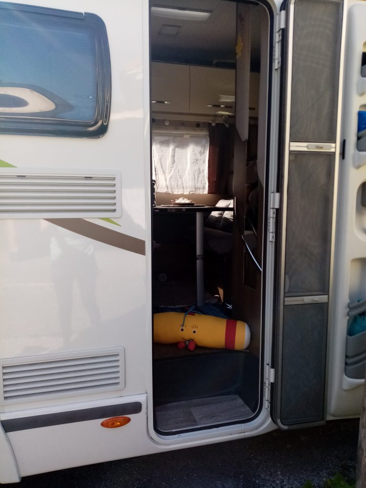

+++
title = "Fine mit der Mine Teil 12"
date = 2021-09-18
[taxonomies]
tags = ["Fine mit der Mine" ]
+++

# „Links und rechts“

Hallo liebes Vorschulkind!

Ich freue mich sehr, dass du heute wieder vorbeischaust. Ich hoffe, du genießt weiterhin deine Ferien und konntest schon viele schöne Dinge zusammen mit deiner Familie unternehmen.

Bestimmt bist du mittlerweile auch schon ein richtiger Profi, was deinen Schulweg betrifft!

Ich möchte dir heute erzählen, was ich in der letzten Woche erlebt habe. Du weißt ja, dass ich zusammen mit Finn und Lena gerade viel unterwegs bin. Und in der letzten Woche haben wir einen tollen Ausflug gemacht. Zusammen mit ihren Eltern sind wir gewandert und haben ganz viele verschiedene Vögel beobachten können. Das hat einen riesigen Spaß gemacht. Natürlich haben wir noch viele andere spannende Dinge sehen können. Da waren Käfer, Raupen, schöne Schmetterlinge, bunte Blumen und tolle Steine. Gemeinsam haben wir alles genau beobachtet. Aber manchmal war ich leider etwas zu langsam und konnte den schönen gelben Schmetterling nicht sehen, den Lena entdeckt hat. Weißt du auch warum? Lena hat gerufen „Schaut mal schnell dort, links neben der Tanne!“ Aber ich habe nicht auf die linke Seite geschaut, sondern auf die rechte Seite. Da habe ich den schönen Schmetterling dann natürlich nicht mehr gesehen.

Naja, aber ab dem Zeitpunkt habe ich mir dann etwas ausgedacht. Ich habe gesehen, dass Lena an ihrer rechten Hand ein tolles Armband trägt. Sie hat mir dann erzählt, dass sie sich so immer gut merken kann, welche ihre linke und welche die rechte Hand ist. Das fand ich klasse. Ich habe dann einfach mein Ersatz-Haarband, das ich dabei hatte, an meinen rechten Schuh gebunden. So konnte ich es mir dann auch gut merken.

Weißt du schon, wo rechts und wo links ist? Falls du es dir auch noch nicht immer merken kannst, bastle doch auch zusammen mit deinen Eltern ein schönes Armband. Oder mache zwei Armbänder in verschiedenen Farben. Für jede Hand eines und du merkst dir anhand der Farben, wo rechts und wo links ist. Ich kann mein Haarband natürlich auch nicht immer an meinem Schnürsenkel lassen, deshalb habe ich mir überlegt, ein rosanes Band in meinen rechten Schuh und ein lilanes Band in meinen linken Schuh zu ziehen. R in Rosa für rechts und L in Lila für links. So werde ich es bestimmt ganz bald können und verpasse keinen schönen Schmetterling mehr.

So, jetzt muss ich mich auch schon wieder verabschieden, liebes Vorschulkind. Wir machen wieder einen Ausflug. Aber diesmal ist die ganze Familie dabei und wir fahren mit dem Wohnmobil.

Ich bin schon ganz aufgeregt, was ich dabei wieder alles erleben werde!  
Ich schicke dir wieder ein Foto mit, wie ich ins Wohnmobil einsteige.

Ich freue mich, wenn wir bald wieder voneinander hören!  
Liebe Grüße,  
deine Fine!

Arbeitsblatt "Links oder Rechts"

[Arbeitsblatt Rechts oder Links](https://volksschule-partenkirchen.de/wp-content/uploads/Arbeitsblatt-Rechts-oder-Links.pdf)[Herunterladen](https://volksschule-partenkirchen.de/wp-content/uploads/Arbeitsblatt-Rechts-oder-Links.pdf)
