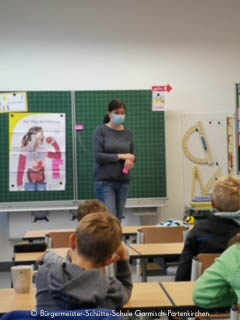

+++
title = "Klasse2000"
date = 2021-11-22
[taxonomies]
tags = ["archiv" ,"grundschulaktivitaeten" ]
+++

Frau Deller erklärt den Weg der Nahrung in unserem Körper

Mit Klasse2000 lernen die Kinder frühzeitig und kontinuierlich das 1x1 des gesunden Lebens – aktiv, anschaulich und mit viel Spaß. So entwickeln Kinder Kenntnisse, Haltungen und Fertigkeiten, mit denen sie ihren Alltag so bewältigen können, dass sie sich wohlfühlen und gesund bleiben. Die Kinder lernen dabei ihren Körper kennen und erfahren, was sie tun können, damit er gesund bleibt. Sie entwickeln wichtige Lebenskompetenzen, z.B. mit Gefühlen und Stress umzugehen, mit Mitmenschen zu kooperieren, Konflikte zu lösen und kritisch zu denken.

Die vier zweiten Klassen wurden im Oktober von Frau Deller, einer geschulten Klasse2000 Gesundheitsförderin besucht und erhielten einen ersten Einblick über den Weg der Nahrung in unserem Körper.

Die Patenschaft für das Klasse2000 Programm der beiden Klassen 2a und 2d übernimmt die **VR-Bank Werdenfels**, die Patenschaft der Klassen 2b und 2c übernimmt die **AOK**. Vielen Dank!
