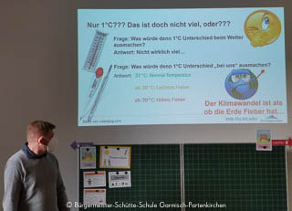

+++
title = "Klima und Klimaschutz"
date = 2021-11-22
[taxonomies]
tags = ["archiv" ,"grundschulaktivitaeten" ]
+++

Herr Lorenz erklärte den Kindern anschaulich und kindgerecht den Begriff „Klima“

Im Rahmen des Heimat- und Sachunterrichts beschäftigte sich die Klasse 2a mit dem Thema Wetter. Abschließend zu dieser Unterrichtssequenz besuchte Herr Lorenz, wissenschaftlicher Mitarbeiter des KIT-Campus Alpin in Garmisch-Partenkirchen unsere Klasse. Herr Lorenz erklärte den Kindern anschaulich und kindgerecht, was man unter dem Begriff „Klima“ versteht, was ein Klimaforscher macht und wie sich das Klima in den letzten 140 Jahren verändert hat. Eine Erderwärmung von 1 Grad Celsius klingt eigentlich nicht viel… Aber jedes Kind weiß, wie es sich anfühlt, wenn man Fieber hat. Und genauso ist es mit der Erde. Die Erde hat Fieber und fühlt sich krank. Auswirkungen der Klimaerwärmung können wir in unserer unmittelbaren Umgebung beobachten, wie das Hochwasser im Sommer oder das Schmelzen des Zugspitzgletschers. Abschließend überlegten die Kinder, was sie selbst tun können, um einen Beitrag zum Klimaschutz zu leisten:

- zu Fuß gehen, statt mit dem Auto zur Schule gebracht zu werden
- Müll vermeiden oder Altes reparieren und wiederverwenden
- bei der Ernährung auf regionale und saisonale Lebensmittel achten, um weite Transportwege zu vermeiden

Mit großem Interesse folgten die Kinder den Erklärungen des Klimaexperten. Vielen Dank für diesen interessanten Vortrag!
