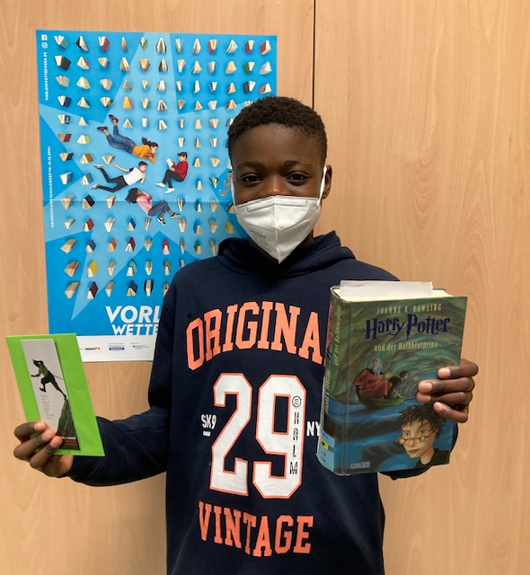

+++
title = "Vorlesewettbewerb der 6. Klassen"
date = 2021-12-06
[taxonomies]
tags = ["archiv" ,"mittelschulaktivitaeten" ]
+++

**Paolo Schulsieger im bundesweiten Vorlesewettbewerb der 6. Klassen**

Am Freitag, 26.11.2021, wurde an unserer Schule der beste Vorleser aus unseren Klassen 6a und 6g gefunden: Es ist Paolo aus der Klasse 6g. In einer äußerst knappen Entscheidung setzte er sich gegen Katharina aus der 6a durch. Beide Vorleser ernteten viel Applaus für ihre ausgezeichneten Leistungen.

Paolo stellte zu Beginn in einer kurzen Einleitung Autor und Titel seines selbst ausgewählten Buchs (Joanne K. Rowlings „Harry Potter und der Halbblutprinz“) vor. Er umriss in wenigen Sätzen dessen Hauptinhalte sowie den Inhalt des von ihm gewählten Textabschnitts. Seine Textstellenauswahl begründete er mit der besonderen Spannung an dieser Stelle. Anschließend trug er den Abschnitt (Dauer: 3 Minuten) fehlerlos und sehr ausdrucksstark laut vor.

Im zweiten Wettbewerbsteil las Paolo einen zweiminütigen Textabschnitt aus einer für ihn bis dato unbekannten Lektüre (Florian Buschendorffs Jugendbuch „Ich werde YouTube-Star“) vor.

Es gelang ihm, die Jury mit ausgefeilter Lesetechnik und gelungener Interpretation zu überzeugen.

Nun steht als nächstes im Februar 2022 der Kreisentscheid an. Wir sind uns sicher, dass Paolo unsere Schule dabei würdig vertreten wird und drücken ihm ganz fest die Daumen!
