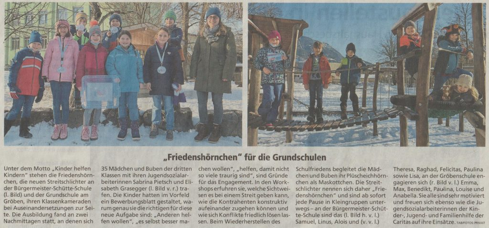
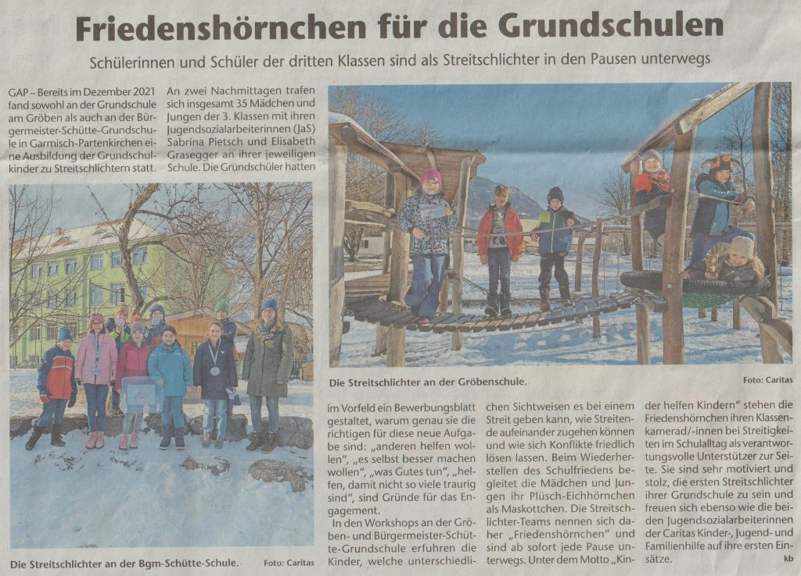

+++
title = "Friedenshörnchen für die Grundschulen"
date = 2022-02-24
[taxonomie]
tags = ["archiv" ,"grundschulaktivitaeten" ,"presse" ,"schulleben" ]
+++

GAP – Bereits im Dezember 2021 fand sowohl an der Grundschule am Gröben als auch an der Bürgermeister-Schütte-Grundschule in Garmisch-Partenkirchen eine Ausbildung der Grundschulkinder zu Streitschlichtern statt. An zwei Nachmittagen trafen sich insgesamt 35 Mädchen und Jungen der 3. Klassen mit ihren Jugendsozialarbeiterinnen (JaS) Sabrina Pietsch und Elisabeth Grasegger an ihrer jeweiligen Schule. Die Grundschüler hatten im Vorfeld ein Bewerbungsblatt gestaltet, warum genau sie die richtigen für diese neue Aufgabe sind: „anderen helfen wollen“, „es selbst besser machen wollen“, „was Gutes tun“, „helfen, damit nicht so viele traurig sind“, sind Gründe für das Engagement.

In den Workshops an der Gröben- und Bürgermeister-Schütte-Grundschule erfuhren die Kinder, welche unterschiedlichen Sichtweisen es bei einem Streit geben kann, wie Streitende aufeinander zugehen können und wie sich Konflikte friedlich lösen lassen. Beim Wiederherstellen des Schulfriedens begleitet die Mädchen und Jungen ihr Plüsch-Eichhörnchen als Maskottchen. Die Streitschlichter-Teams nennen sich daher „Friedenshörnchen“ und sind ab sofort jede Pause unterwegs. Unter dem Motto „Kinder helfen Kindern“ stehen die Friedenshörnchen ihren Klassenkamerad/-innen bei Streitigkeiten im Schulalltag als verantwortungsvolle Unterstützer zur Seite. Sie sind sehr motiviert und stolz, die ersten Streitschlichter ihrer Grundschule zu sein und freuen sich ebenso wie die beiden Jugendsozialarbeiterinnen der Caritas Kinder-, Jugend- und Familienhilfe auf ihre ersten Einsätze. **kb**

[Zum Kreisboten des Merkurs](https://www.merkur.de/lokales/garmisch-partenkirchen/kreisbote/garmisch-partenkirchen-friedenshoernchen-fuer-die-grundschulen-91346610.html)

Artikel des Tagblatts

Artikel des Kreisboten
