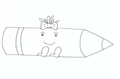

+++
title = "Fine mit der Mine Teil 2"
date = 2021-09-07
[taxonomies]
tags = ["Fine mit der Mine" ]
+++

# **„Fine und das große Chaos“**

Liebe Eltern

wir alle kennen es gut. Das Spielen ist vorbei und die Spielsachen im Kinderzimmer räumen sich nicht von alleine auf. Das Kind ist plötzlich so müde, dass es ohne Zähneputzen direkt ins Bett möchte und leider ist die Kraft zum Aufräumen auch nicht mehr da.  
Doch auch das Aufräumen gehört zum Spielen dazu und ist ein wichtiger Aspekt, den Kinder lernen müssen.  
Auch in der Schule ist ein strukturierter Arbeitsplatz, das Herrichten des eigenen Materials und das Aufräumen ein wichtiges Thema. Von Beginn an legen wir Wert darauf, dass jedes Kind seinen eigenen Platz an der Garderobe hat und alle seine Materialien an speziell dafür vorgesehenen Plätzen findet. So werden zum Beispiel Arbeitsblätter in dafür vorgesehenen Ablagen gesammelt, Kunstmaterialien in Kästen verstaut und auch die Bücher haben ihre festen Plätze. Der Arbeitsplatz Ihres Kindes in der Schule sowie daheim und auch der Schulranzen sollten immer so strukturiert und geordnet sein, dass jedes Kind sich voll und ganz auf seine Aufgaben konzentrieren kann.  
Natürlich bedarf es hier noch einiger Hilfe, bis jedes Kind es schafft, seine Unterrichtsmaterialien und seinen Arbeitsplatz zu ordnen und zu strukturieren, aber wir können bereits jetzt beginnen, jedes Kind dabei zu unterstützen dieses zu lernen. 

**Wie genau kann ich mein Kind dabei unterstützen?**  
Wichtig ist, dass jedes Spielzeug seinen Platz hat. So weiß das Kind genau, wo was hingehört und es fällt ihm leichter, Ordnung zu schaffen.  
Lassen Sie das Aufräumen doch auch zu einem „Spiel“ werden. Lassen Sie Ihr Kind eine schöne Musik auswählen, die Sie ab jetzt immer dann laufen lassen, wenn es ans Aufräumen geht.  
Außerdem lässt es sich schneller aufräumen, wenn man sich dabei gegenseitig unterstützt, es wie einen Wettbewerb werden lässt oder nach dem Aufräumen eine Belohnung wartet.  
Sollten Sie zu diesem Thema weitere Informationen oder Tipps zum Üben benötigen, kontaktieren Sie uns gerne telefonisch oder per Mail.

**Zum heutigen Ablauf:**  
Bauen Sie zu Beginn gemeinsam mit Ihrem Kind einen Turm oder ein Gebäude aus Holzbausteinen oder ähnlichen Bausteinen.  
Wählen Sie gemeinsam mit Ihrem Kind eine Musik aus, die sie ab nun als Aufräummusik nutzen möchten und räumen Sie gemeinsam mit Ihrem Kind die Bausteine auf.  
  
Lesen Sie Ihrem Kind danach den zweiten Teil der Geschichte über „Fine mit der Mine“ vor. Sie trägt den Titel „Fine und das große Chaos“. Sie können alternativ auch die Geschichte von der Homepage unserer Schule abspielen und vorlesen lassen.  
  
Danach kann Ihr Kind das Arbeitsblatt zu „Fine und das große Chaos“ ausmalen. Vielleicht möchten Sie es uns anschließend per Mail zuschicken. Wir würden uns sehr freuen.  
  
Lesen Sie Ihrem Kind abschließend das Gedicht als Abschlussritual unserer „Vorschulkinderzeit daheim“ vor. Im Laufe der Zeit wird Ihr Kind dieses bestimmt mitsprechen können.  
   
Wir hoffen, auch die zweite „Vorschulkinderzeit daheim“ hat Ihnen und Ihrem Kind gefallen und wir dürfen Sie auch beim nächsten Mal wieder begrüßen.  
_Herzliche Grüße von Fine und den Lehrer:innenn der Bürgermeister-Schütte-Grundschule!_

* * *

Unser Anfangsgedicht

Fine mit der Mine

Unser Abschlussgedicht

Downloads

[Fine und das große Chaos](https://volksschule-partenkirchen.de/wp-content/uploads/Fine-und-das-grosse-Chaos.pdf)

[Mein-Arbeitsplatz](https://volksschule-partenkirchen.de/wp-content/uploads/2021/02/Mein-Arbeitsplatz.pdf)

[Geschichte Fine Teil 2](https://volksschule-partenkirchen.de/wp-content/uploads/Geschichte-Fine-Teil-2.pdf)
