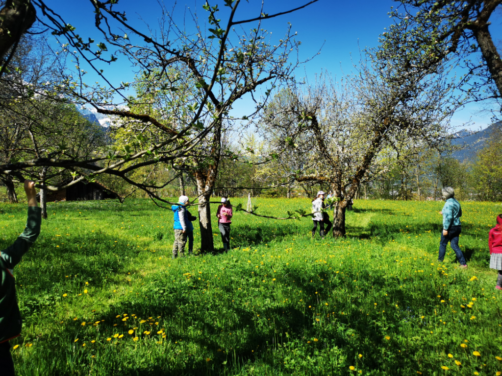
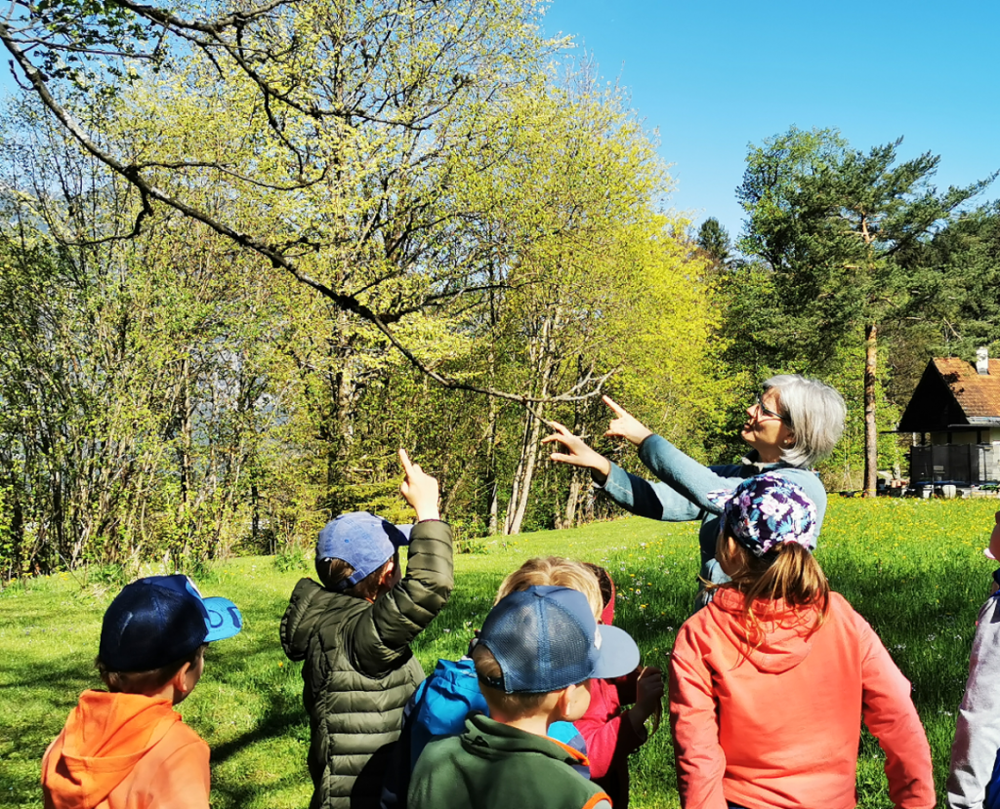

+++
title = "Projekt Streuobstwiese der Klassen 2a und 2d in Kooperation mit dem Netzwerk „Unser Land“"
date = 2022-05-17
[taxonomies]
tags = ["archiv" ,"Grundschulaktivitäten" ]
+++

Äpfel sind für uns, ob Groß oder Klein, das beliebteste Obst – und wachsen im eigenen oder nächsten Garten. Selbst zu beobachten, was alles rund um den Apfelbaum, auf der Wiese passiert, wenn alles blüht, welche Insekten, Vögel und anderen vielfältigen Tiere hier vorbeikommen, ist für die Schüler(innen) nicht nur spannend, sondern bringt sie auch zum Nachfragen und Verstehen: Was braucht es alles, damit ein Baum blüht, Früchte kommen, wachsen und reifen? Welche Tiere verschiedenster Art leben im Umfeld des Baumes? Wer pflegt den Baum und die ganze Streuobstwiese? Was macht der Bauer mit seinen Äpfeln? Warum sind Wiesen mit Obstbäumen nicht nur schön, sondern auch wirklich kostbar und wertvoll?

Im Rahmen des Projekts „Schule auf der Streuobstwiese“, welches in den beiden zweiten Klassen in Kooperation mit dem Netzwerk „Unser Land“ mit der Expertin Beate Löw-Schneyder durchgeführt wurde, erfahren die Kinder alles über die Entwicklung von der Blüte zur Frucht, den Apfelbaum und seine Gäste, die Bedeutung der Honigbienen und anderer Insekten für die Streuobstwiese bis hin zur Apfelernte und Verarbeitung.

Neben Unterrichtsbausteinen im Klassenzimmer werden auch außerschulische, erlebnisorientierte Lernorte genutzt; direkt vor Ort, nahe am Lebensraum der Kinder. Hier begegnen sie echten Experten, die vielfältiges Wissen und ihre Erfahrungen mitbringen. So lernen die Kinder den Wert dieser Lebensräume und Lebensmittel ihrer Heimat kennen und schätzen.

