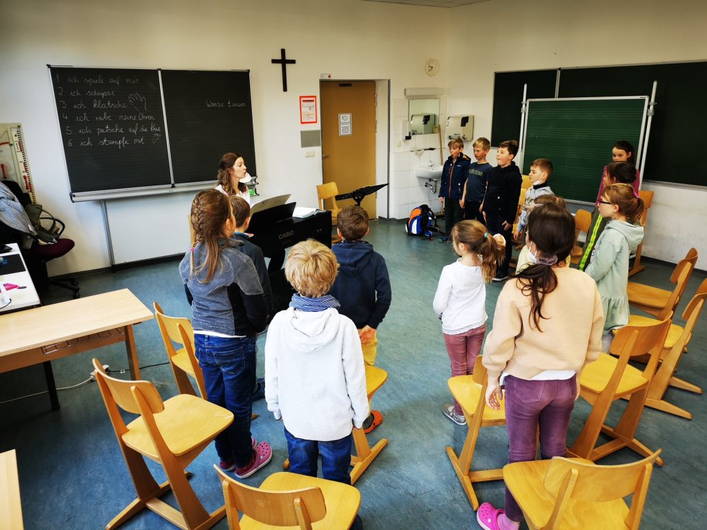

+++
title = "Singklasse in Kooperation mit der Musikschule"
date = 2022-05-17
[taxonomie]
tags = ["archiv" ,"grundschulaktivitaeten" ]
+++

„_Das Einzige was besser ist als singen, ist mehr zu singen_.“ (Ella Fitzgerald)

Daher freuen sich die Kinder der 2. Klassen sehr, dass während des gesamten Schuljahres einmal wöchentlich Frau Hornsteiner von der Musikschule in unsere Schule kommt, um mit kleinen Schülergruppen zu singen. Ziel dieser „Singstunde“ ist, die Kinder über das Singen an musikpraktische Erfahrungen und musikalisches Erleben heranzuführen. Die Kinder sind in jeder Singstunde fast ununterbrochen gefordert: Singen in der Gruppe und einzeln, hören, vergleichen, verändern, beobachten, bewegen, fühlen, darstellen. Durch die kontinuierliche Förderung des musikalischen Potentials erfahren die Kinder ihre eigene Musikalität ebenso wie die Freude am Musizieren.

Im Rahmen des gemeinsamen Singens werden dabei auch die sozialen Kompetenzen der Kinder in hohem Maße gefordert und gefördert.

Die Schülerinnen und Schüler der 2. Klassen freuen sich jeden Donnerstag, wenn Frau Hornsteiner mit ihnen gemeinsam singt und musiziert.

