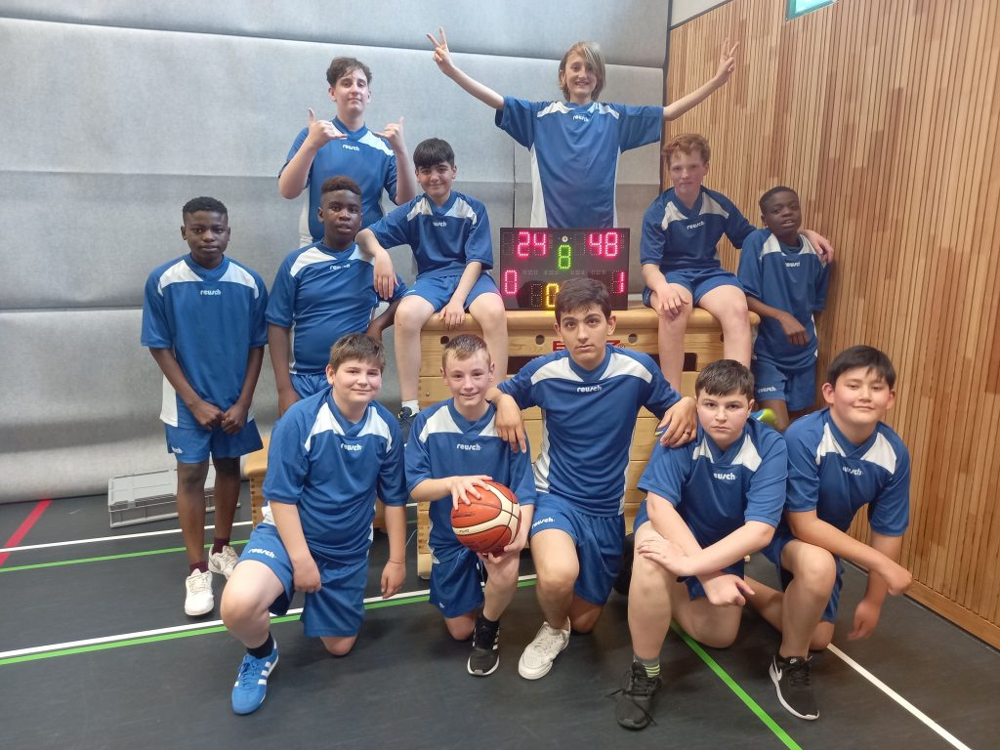

+++
title = "Partenkirchner Mittelschule fördert den Schulsport"
date = 2022-05-25
[taxonomie]
tags = ["archiv" ,"allgemein" ,"mittelschulaktivitaeten" ]
+++

Mit dem Ende der Pandemie rückt auch der Schulsport wieder mehr in den Fokus der sportlichen Schüler und Schülerinnen. So auch an der Bürgermeister-Schütte-Mittelschule. Schon im letzten Schuljahr wurde im Auftrag von Rektorin Schmidt ein Sportteam aus mehreren Lehrkräften unter der Führung von Frau Dr. Schalkhäuser-Riesch gebildet, das es sich zum Ziel setzte, u.a. Schulmannschaften zu beleben bzw. neu aufzubauen. Dazu wurden die Schüler im Vorfeld abgefragt und ihre Interessen gebündelt.

Nun konnte offensiv für die Teilnahme an den staatlichen Turnieren, u.a. „Jugend trainiert für Olympia“ unter den Schülern der MS Partenkirchen geworben werden.

Und so wurde es möglich, nach einer langen Durststrecke, mehrere Mannschaften zu melden. Neben Handball, Feldhockey und Fußball meldete die Schulleiterin auch zwei Wettkampfteams im Basketball an; u.a. bei den Jungen IV.

Aber erst durch die Aufhebung der pandemischen Lage durfte mit den Spielen begonnen werden.

Am 26.04.2022 war es soweit. Die Basketballer, überwiegend Buben der 5. und 6. Ganztagsklassen, durften den Auftakt der Wettkampfwochen bestreiten. Im Kreisfinale traten sie gegen das Staffelsee Gymnasium Murnau an. In Murnau trafen sie auf ein mit Basketballer gespicktes Team unter der Leitung von Sebastian Rapp und Betreuerin Sandra Neumann. Trotz der technischen Überlegenheit der Gegner gaben die Partenkirchener alles, und konnten durch schnelle Fast-Breaks diese unter Druck setzen. Gespielt wurde in 8 x 5 Minuten ohne Spielerwechsel. Der Vorteil: kompletter Wechsel, Spielanteile für alle mitgereisten Spieler und stets die Möglichkeit Taktiken, Fehler und Positives in den kurzen Pausen gleich anzusprechen.

Zu Beginn tasteten sich die Mannschaften ab, so dass es nach dem ersten Achtel sogar 4:5 für die MS Partenkirchen stand. Doch mit zunehmender Spieldauer brachten die Murnauer ihre Spielerfahrung und ihr ganzes Können ein. Im dritten Achtel zogen sie auf 23:7 davon. Nach zwischenzeitlichen Schwierigkeiten setzten die Partenkirchener die Anweisungen – u.a. frühzeitige Manndeckung, mehr Übersicht in der Abwehr, schnelles Umschalten von Abwehr und Angriff - ihres Betreuers Kurt Christian endlich um. Und so taten sie es ihren Gastgebern gleich. Von da ab spielten sie sich von Minute zu Minute in einen wahren Spielrausch hinein. Endlich konnten sie Paroli bieten. Und dank ihrer nun treffsicheren und sehr schnellen Schüler Milot Pantina, Paolo Desmond, Peter Desmond und Maxwell Odidika konnten sie den Abstand verkürzen. Obwohl jedes Achtel sehr kraftraubend war, kämpften sie um jeden Zentimeter. Am Schluss stand es 48:24 für die Murnauer.

Trotz dieser Niederlage gingen die Schüler der Bürgermeister – Schütte – Mittelschule erhobenen Hauptes vom Platz.

Der Aufbau der Mannschaften hat erst begonnen. Dieses Spiel und die tolle sportliche Einstellung der Schüler zu den Schulmannschaften lässt die Verantwortlichen der Mittelschule Partenkirchen auf eine erfolgreiche Zukunft hoffen.

stehend: Peter Desmond, Maxwell Odidika, Luciano Buzic, Juan Hussein, Quentin Fögler, Magnus Pölt, Paolo Desmond  
kniend: Felix Huth, Milot Pantina, Semich Siakyroglou, Fran Bozic,Morteza Ahmadi
