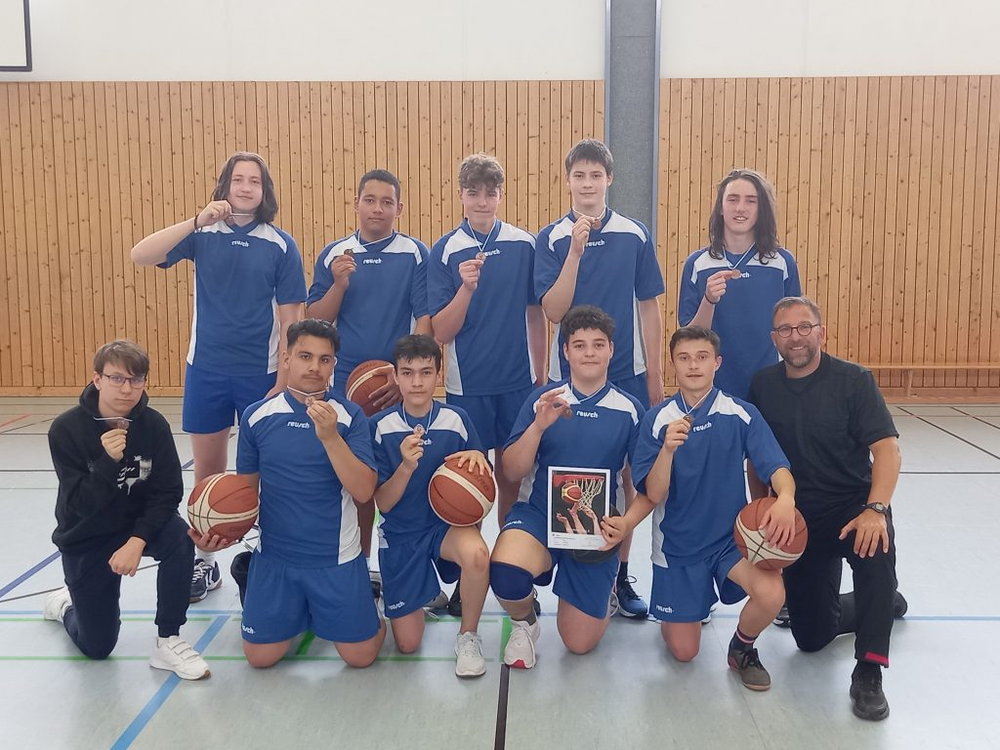

+++
title = "Dritter von Oberbayern"
date = 2022-05-31
[taxonomie]
tags = ["archiv" ,"mittelschulaktivitaeten" ,"schulleben" ]
+++

Am 16.05.2022 fand die Bezirksmeisterschaft der Mittelschulen in Basketball Jungen III/2 (Jg.05 bis 2009) im Rahmen von „Jugend trainiert für Olympia“ in Edling statt.

Für alle Spieler der MS Partenkirchen war es das erste Mal, für ihre Schule aufzulaufen und im Basketball Wettkampfatmosphäre zu schnuppern.

Nach den Vorbereitungen während des Schulsports in den Wintermonaten und in den Extrastunden auf dem Hartplatz waren die Partenkirchner Jungs heiß auf das Turnier. Dafür nahmen sie auch gerne die 140 Kilometer lange Anreise in Kauf. In Edling, im Landkreis Rosenheim, trafen sich die vier besten Teams von Oberbayern.

Das Losglück meinte es gut mit den Buben der Mittelschule aus Partenkirchen. Sie hatten zwischen ihren Partien jeweils ein Spiel Pause. Und auch der Gegner der ersten Partie schien machbar zu sein. Doch es kam anders.

In der ersten Hälfte gegen MS Edling hielten sie mit. Am Ende stand es 13:6 (7:4) für den Gastgeber. Zu viele Chancen blieben ungenutzt, und das genaue Zuspiel ließ noch zu wünschen übrig. Auch spielte die Aufregung, ihre hohen Erwartungen an sich selbst und die Umstellung in den ‚Wettkampfsport‘ eine Rolle. Sie lernten aus ihren Fehlern und konnten in ihrem zweiten Spiel gegen MS Maisach ihr Repertoire abrufen. Endlich! Die weiten Zuspiele für die Flügelspieler kamen an, die Bälle fanden ihr Ziel und sie harmonierten mehr miteinander. Es war herrlich, sie so spielen zu sehen. Die Buben gewannen mit 17:8.

Im letzten Spiel des Tages mussten sie gegen sehr guten Spielern MS Unterschleißheim und späteren Turniersieger antreten.

Hier war das Motto ‚Kämpfen mit Freude‘ angesagt. Wollte man nicht unter die Räder kommen, mussten die Schützlinge um ihren Betreuer Kurt Christian alles geben. Vor allem die Abwehr musste, wie in ihrem zweiten Spiel konsequent in der Abwehr agieren. Durch zu viel Respekt vor ihrem eigenen Können fanden zahlreiche Korbwürfe nicht ins Ziel. Das war schade, sie hätten verdient; so verlor man am Ende 33:4.

Ein kleine Randbemerkung: Bei einer anderen Mittelschule stand es 85:2….

Die Mannschaft verdient für ihren sportlich, motivierten Einsatz, Anerkennung und Respekt. Der Lohn: Ein dritter Platz im Basketball bei den Mittelschulen aus Oberbayern.

stehend: Alexandru Bejenaru, Mehmet Kocagöbek, Damian Krause, Marin Simunovic, Leonhard Paglia  
kniend: Lyuboslav Kostov, Mohmmad Bakdash, Valentino Mitrov, Lorjan Blakaj, Blend Pantina und Betreuer Kurt Christian

Mit dem Ende der Pandemie rückt auch der Schulsport wieder mehr in den Fokus der sportlichen Schüler und Schülerinnen. So auch an der Bürgermeister-Schütte-Mittelschule. Schon im letzten Schuljahr wurde im Auftrag von Rektorin Schmidt ein Sportteam aus mehreren Lehrkräften unter der Führung von Frau Dr. Schalkhäuser-Riesch gebildet, das es sich zum Ziel setzte, u.a. Schulmannschaften zu beleben bzw. neu aufzubauen. Dazu wurden die Schüler im Vorfeld abgefragt und ihre Interessen gebündelt.

Nun konnte offensiv für die Teilnahme an den staatlichen Turnieren, u.a. „Jugend trainiert für Olympia“ unter den Schülern der MS Partenkirchen geworben werden.

Und so wurde es möglich, nach einer langen Durststrecke, mehrere Mannschaften zu melden. Neben Handball, Feldhockey und Fußball meldete die Schulleiterin auch zwei Wettkampfteams im Basketball an; u.a. bei den Jungen IV.

Aber erst durch die Aufhebung der pandemischen Lage durfte mit den Spielen begonnen werden.

Am 26.04.2022 war es soweit. Die Basketballer, überwiegend Buben der 5. und 6. Ganztagsklassen, durften den Auftakt der Wettkampfwochen bestreiten. Im Kreisfinale traten sie gegen das Staffelsee Gymnasium Murnau an. In Murnau trafen sie auf ein mit Basketballer gespicktes Team unter der Leitung von Sebastian Rapp und Betreuerin Sandra Neumann. Trotz der technischen Überlegenheit der Gegner gaben die Partenkirchener alles, und konnten durch schnelle Fast-Breaks diese unter Druck setzen. Gespielt wurde in 8 x 5 Minuten ohne Spielerwechsel. Der Vorteil: kompletter Wechsel, Spielanteile für alle mitgereisten Spieler und stets die Möglichkeit Taktiken, Fehler und Positives in den kurzen Pausen gleich anzusprechen.

Zu Beginn tasteten sich die Mannschaften ab, so dass es nach dem ersten Achtel sogar 4:5 für die MS Partenkirchen stand. Doch mit zunehmender Spieldauer brachten die Murnauer ihre Spielerfahrung und ihr ganzes Können ein. Im dritten Achtel zogen sie auf 23:7 davon. Nach zwischenzeitlichen Schwierigkeiten setzten die Partenkirchener die Anweisungen – u.a. frühzeitige Manndeckung, mehr Übersicht in der Abwehr, schnelles Umschalten von Abwehr und Angriff - ihres Betreuers Kurt Christian endlich um. Und so taten sie es ihren Gastgebern gleich. Von da ab spielten sie sich von Minute zu Minute in einen wahren Spielrausch hinein. Endlich konnten sie Paroli bieten. Und dank ihrer nun treffsicheren und sehr schnellen Schüler Milot Pantina, Paolo Desmond, Peter Desmond und Maxwell Odidika konnten sie den Abstand verkürzen. Obwohl jedes Achtel sehr kraftraubend war, kämpften sie um jeden Zentimeter. Am Schluss stand es 48:24 für die Murnauer.

Trotz dieser Niederlage gingen die Schüler der Bürgermeister – Schütte – Mittelschule erhobenen Hauptes vom Platz.

Der Aufbau der Mannschaften hat erst begonnen. Dieses Spiel und die tolle sportliche Einstellung der Schüler zu den Schulmannschaften lässt die Verantwortlichen der Mittelschule Partenkirchen auf eine erfolgreiche Zukunft hoffen.
