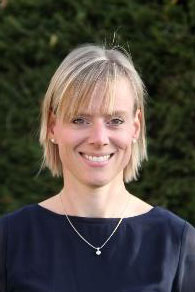

+++
weight = 5
date = "2021-04-30"
title = "Schulpsychologische Beratung"
template = "toppage.html"
description="Aufgaben der Schulpsychologie sind die Betreuung und Beratung von Schülern, Eltern und Lehrern bei schulischen Fragestellungen und auftretenden Schwierigkeiten. Die Beratung ist freiwillig, vertraulich und kostenlos. Sie schließt die enge Zusammenarbeit mit Beratungslehrkräften und außerschulischen Einrichtungen ein."

[extra]
toc = true

+++

## Wer ist für unsere Schule zuständig?

**Stefanie Seyboth**  
Staatliche Schulpsychologin

Liebe Eltern, liebe Schüler:innen,

als zuständige Schulpsychologin möchte ich mich und das Angebot der schulpsychologischen Beratung hiermit kurz vorstellen:  
  
Aufgaben der Schulpsychologie sind die Betreuung und Beratung von Schülern, Eltern und Lehrern bei schulischen Fragestellungen und auftretenden Schwierigkeiten.  
Die Beratung ist freiwillig, vertraulich und kostenlos.  
Sie schließt die enge Zusammenarbeit mit Beratungslehrkräften und außerschulischen Einrichtungen ein.

## Wann wende ich mich an die Schulpsychologin?

Bei

- schulischen Lern- und Leistungsschwierigkeiten
- schulbezogenen Problemen im Verhaltens- und Erlebnisbereich wie  
    z.B. Schulangst, Prüfungsangst, Aggressivität etc.
- besonderen Begabungen

**Wie kann ich Kontakt zur Schulpsychologin aufnehmen?**

## Kontakt:
{{person(name = "Stefanie Seyboth" , phone="+49 8824 9146300 " , mail="stefanie.seyboth@schulpsychologie.gsms-ob.de")}}
Dienstag 8:00 - 8:45 Uhr  
james - loeb - grundschule, dr. august - einsele - ring 8, 82418 murnau  

Ich freue mich auf eine gute Zusammenarbeit.  

Formulare:

[Anmeldebogen](https://volksschule-partenkirchen.de/wp-content/uploads/Anmeldebogen-GS-MS-SchütteGarmisch-1.pdf)

[Schweigepflichtentbindung](https://volksschule-partenkirchen.de/wp-content/uploads/Schweigepflichtentbindung.pdf)

* * *

## Kontakt zur Schulberatung:

{{person(name = "Robert Rauch" , phone="+49 176 341 70 959 " , mail="robert.rauch@schulberatung-gap.de")}}
Montag 9:15 - 10:00 Uhr  
Mittwoch 9:30 - 10:15 Uhr  

* * *

## Kontakt bei Rechenschwäche

{{person(name = "Katharina Kößler" , phone="+49  8821  9103560   " , mail="foerderstelle-rechenschwaeche.gap@lra-gap.de")}}

Montag 12.00 Uhr – 12.45 Uhr  

[Anmeldebogen-Rechenschwäche](https://volksschule-partenkirchen.de/wp-content/uploads/Anmeldebogen-Rechenschwäche.pdf)
