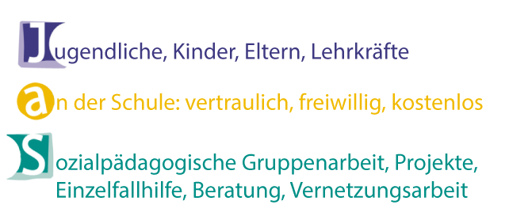
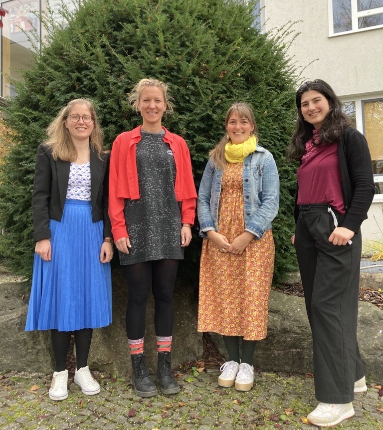
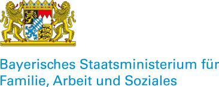

+++
weight = 5
date = "2024-10-28"
title = "Jugendsozialarbeit an Schulen"
template = "toppage.html"
description="JaS ist eine Beratungsstelle innerhalb der Schule und richtet sich an Schüler, Eltern sowie Lehrkräften. JaS schlägt eine Brücke zwischen dem System Schule und der Kinder- und Jugendhilfe."

[extra]
toc = true

+++

## **Jugendsozialarbeit an der Bürgermeister-Schütte Grund- und Mittelschule**

#### **Was ist Jugendsozialarbeit an Schulen (JaS)?**

JaS ist eine Beratungsstelle innerhalb der Schule und richtet sich an Schüler, Eltern sowie Lehrkräften. JaS schlägt eine Brücke zwischen dem System Schule und der Kinder- und Jugendhilfe.

<!-- more -->

#### Wir sind da für

**Dich**, **liebe Schülerin, lieber Schüler, melde dich bei uns, wenn du…**

- zu Hause oder in der Schule in Problemen steckst, mit denen du alleine nicht klarkommst,
- nicht weißt, wie es nach der Schule weitergehen soll,
- persönliche Probleme hast (Streit mit Freunden, Mobbing, Schulangst, Suchtprobleme, …),
- etwas angestellt hast und nicht mehr weiter weißt,
- einfach nur mal reden möchtest.

**Sie**, **Liebe Eltern und Erziehungsberechtigte, melden Sie sich bei uns, wenn Sie…**

- Immer weniger an Ihr Kind herankommen und familiäre oder schulische Probleme zunehmend belastend werden,
- feststellen, dass Ihre Tochter/Ihr Sohn den Schulbesuch zunehmend meidet oder Angst davor hat,
- Vermittlung zu anderen Institutionen wünschen,
- sich Sorgen um die berufliche Zukunft Ihres Kindes machen.

**Euch**, **liebe Lehrkräfte, melden Sie sich bei uns, wenn Sie…**

- Unterstützungsbedarf bei einem Schüler/einer Schülerin wahrnehmen,
- eine sozialpädagogische Einschätzung und Beratung in einer bestimmten Situation wünschen,
- bei Elterngesprächen sozialpädagogische Unterstützung wünschen.

## **Ansprechpartnerinnen**

v. l. Elisabeth Grasegger, Veronika Klarmann, Maria-Theresa Zink, Michaela Briechle

#### **Grundschule**

{{person(name = "Sozialpädagogin (M.A.) Elisabeth Grasegger" , phone="+49 172 7091047" , mail="Elisabeth.Grasegger@caritasmuenchen.org")}}

Mo - Do: 07.30 - 16.00 Uhr  
Fr: 07:30 - 14.00 Uhr  

#### **Mittelschule**

{{person(name = "Sozialpändagogin (B.A.) Michaela Briechle" , phone="+49 152 22784460" , mail="Michaela.Briechle@caritasmuenchen.org")}}

Mo - Do: 07.45 - 16.00 Uhr   
Fr: 7:45 - 13:00 Uhr

## [Aktivitäten](/categories/jugendsozialarbeit-an-schulen/)

_Gefördert vom  Bayerischen Staatsministerium für Familie, Arbeit und Soziales,_  
_dem Landkreis und der Gemeinde, Träger: Caritas Zentrum Ga.-Pa._

 

