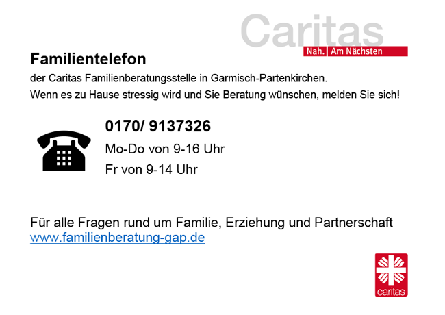
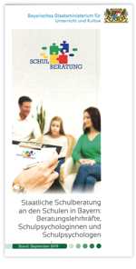

+++
title = "Schulberatung"
template = "toppage.html"
weight = 6
date = 2023-01-10

[extra]
toc = true
+++

## Aktuell

Liebe Eltern und liebe Erziehungsberechtigte,

aufgrund der Sondersituation durch das Corona Virus die **Beratungsstelle für Eltern, Kinder, Jugendliche u. Familien Caritas Zentrum Garmisch-Partenkirchen** eine weitere Nummer eingerichtet:

Die Familienberatung kann jetzt zusätzlich über das _Familientelefon_ zu den angegebenen Zeiten erreicht werden:

Oder auch weiterhin ganz regulär zu den Geschäftszeiten  
  
Mo-Do, 08:00 – 12:30 Uhr, 13:30 – 16:00 Uhr,  
Fr, 08:00 – 13:00 Uhr

unter der Tel.-Nr. 08821-94348-40

* * *

## **Allgemein**

An unserer Schule stehen Ihnen verschiedene Lehr- und Fachkräfte zur Seite und beraten Sie, liebe Eltern und Erziehungsberechtigte, ebenso Euch Schüler(innen) bei

[Flyer-Schulberatung](https://volksschule-partenkirchen.de/wp-content/uploads/2020/09/Flyer-Schulberatung.pdf)

- Lern- und Leistungsschwierigkeiten  
- schulischen Krisensituationen  
- besonderen Begabungen
- Verhaltensproblemen  
- Fragen zur Schullaufbahn  
- Fragen zur beruflichen Orientierung
- Depression _(für weitere Infos bitte klicken)_

  
Erster Ansprechpartner ist in der Regel die Klassenlehrerin bzw. der Klassenlehrer.  
  
Außerdem stehen Beratungslehrer oder die für Sie zuständige Schulpsychologin zur Verfügung.  
  
Für Euch Schülerinnen und Schüler haben die Vertrauenslehrer ein offenes Ohr. Sie sind neben der Klassenleitung die erste Anlaufstelle bei Problemen untereinander. Außerdem könnt Ihr Euch jederzeit an die Schulsozialarbeiterinnen (JaS) hier an unserer Schule wenden.  
  
  
**Wichtig zu wissen:**  
Alle in der Beratung Tätigen unterliegen der Schweigepflicht gegenüber Dritten!  
Die Beratung ist kostenlos! Wartezeiten lassen sich nicht immer vermeiden; eine rechtzeitige telefonische Anmeldung wird empfohlen!

* * *

### **Über Depression an Schulen aufklären**

  
Die Aufklärung über psychische Erkrankungen, insbesondere auch über Depression und Angststörungen, ist eine gesamtgesellschaftliche Aufgabe, zu der auch die Schulen einen wichtigen Beitrag leisten. Gesundheitsförderung und auch die Themen wie psychische Gesundheit und Umgang mit Stress spielen nicht nur in der Erwachsenenwelt eine große Rolle.  
  
An den Schulen sind die regionalen Schulpsychologinnen, Schulpsychologen und Beratungslehrkräfte vor Ort erste Ansprechpartner für Kinder und Jugendliche zu seelischen Notlagen, die über Schulprobleme hinausgehen. Um eine frühe Diagnose und die entsprechende Therapie zu ermöglichen, übermitteln sie vor Ort wichtige und aktuelle Hinweise zu Beratungsstellen, Ärzten, Therapeuten und Kliniken im jeweiligen Schulumfeld.
