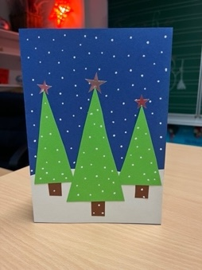

+++
title = "Zeitungsprojekt 7M"
date = "2024-01-01"
template = "page.html"
[taxonomies]
tags = ["Aktuelles" ,"Presse", "Kultur" ]
klassen = ["7. Klasse"]
+++

**50 Jahre Momo in Garmisch-Partenkirchen**

Im Jahr 2023 wird in Garmisch-Partenkirchen „50 Jahre Momo“ mit
verschiedenen Veranstaltungen groß gefeiert.

Michael Ende, geboren 1929 in Ga.-Pa., hat diesen Roman geschrieben und
das Thema der Geschichte ist immer noch aktuell.

In der ganzen Stadt hängen Plakate, Fahnen und auf Bänken sind QR-Codes
mit Informationen zu diesem Jubiläum.

<!-- more -->

Auf einem Unterrichtsgang mit der Klasse zum Michael-Ende-Kurpark
besuchten wir das Geburtshaus des Autors. Im Amphitheater las uns Frau
Rau den Anfang der Geschichte vor.

Leon, 7M

Das kleine Mädchen Momo kämpft gegen eine Übermacht von Zeitdieben, die
grauen Herren. Diese Mächte des Bösen rauben den Menschen ihre
Lebenszeit und damit die Freude am Leben. Mit persönlichem Mut und der
Hilfe guter Mächte gelingt es Momo die grauen Herren zu vernichten.

Wir haben die Geschichte gelesen, das Hörbuch angehört und den Film
analysiert.

Jeder Schüler verglich einen Charakter im Film mit der Geschichte. Dazu
haben wir noch ein Portfolio und ein Titelbild gestaltet.

Dilara, 7M

Zum Abschluss des Momo-Projekts war ein Besuch der Sonderausstellung
„Geh doch zu Momo“ im Museum Werdenfels geplant.

Hier erfährt man viel über das Leben von Michael Ende und es gibt viele
Bilder, Marionetten und Hörstationen zum Roman „Momo“.

Martina, 7M

**Klassenpartnerschaft 2b, 7M/G**

1.  **Treffen**

*Gespenster-Geschichte und Basteln*

Für das Schuljahr 2023/24 haben die Klassen 7M, 7G und 2b eine
Schulpartnerschaft gestartet.

Vor den Herbstferien trafen sich die Klassen zu einem Gespensterprojekt.
Zuerst stellten die Schüler sich gegenseitig vor. Jeweils ein Schüler
der 2. Klasse arbeitete mit einem Siebtklässler zusammen. Anschließend
lasen die Zweitklässler uns eine Geschichte über ein Gespenst vor.
Danach haben wir dann ein Gespenst aus einem Taschentuch, Gummi und
einem Stift gebastelt. Nachdem die Schüler fertig mit dem Gespenst
waren, halfen die Große den Kleinen bei Aufgaben zu der Bastelanleitung
und der Geschichte.

Paul, 7M

1.  **Treffen**

*Märchenstunde*

Am 1. Dezember dieses Jahres haben sich die drei Klassen im
Klassenzimmer der 7M zu einer Märchenstunde getroffen. Die Klasse 7M hat
sich lange auf diesen Auftritt vorbereitet. Jeder Schüler bereitete
seinen eigenen Textabschnitt vor. Dann war der Tag gekommen. Die Klasse
2b wurde im Klassenzimmer der 7M empfangen. Sie setzten sich in die
Mitte des Klassenzimmers und die Siebtklässler haben ihnen das Märchen
„Hänsel und Gretel“ aus der Sammlung der Gebrüder Grimm vorgelesen. Die
Geschichte wurde spannend vorgetragen und mit passenden Bildern
präsentiert. Die Zweitklässler fanden es sehr schön und spannend. Zum
Abschluss durfte sich jeder Schüler einen Spekulatius nehmen.

Jonas, 7M

1.  **Treffen**

*Oper „Hänsel & Gretel“ im Gärtnerplatztheater München*

Am 6. Dezember sind wir, die 7M, 2b und 7G mit dem Doppeldecker-Bus nach
München zum Gärtnerplatztheater in die Oper „Hänsel und Gretel“ von
Engelbert Humperdinck, gefahren. Eigentlich ist ein Ticket sehr teuer
aber es gibt günstigere Schülerkarten.

Das beeindruckende Theater sieht aus wie ein großes Schloss mit vielen
verschiedenen Kronleuchtern. Es gibt eine große Bühne und einen großen
Saal mit vier Balkonen.

Drei sehr beeindruckende verschiedene Bühnenbilder wurden gezeigt:

-   1= Das Haus von Hänsel und Gretel

-   2= Der Wald

-   3= Das Haus von der Hexe

In zwei Szenen flogen die Darsteller sogar über die Bühne.

In dieser Oper wird die Handlung des Märchens nicht erzählt, sondern
gesungen. Die Sänger (Schauspieler) wurden von einem Live-Orchester
unterstützt. Uns haben die Szenen mit der Hexe am besten gefallen. Die
Hexe wurde von einem Mann dargestellt, der sehr temperamentvoll und
lustig war.

Klara, 7M

1.  **Treffen**

*Kunstprojekt: Weihnachtswald*

Am Freitag, den 22.12.23 war noch ein Kunstprojekt mit der 2b, 7M, 7G
geplant. Wir verteilten uns auf unsere drei Klassenzimmer. Die Schüler
sollten zusammen einen Weihnachtswald gestalten. Die dazu nötigen
Materialien und Arbeitsanweisungen erklärten die Zweitklässler den
Siebtklässlern. Mit passender Weihnachtsmusik und in Team-Arbeit
entstanden schöne Kunstwerke.

Milan, 7M

**Besuch einer Verhandlung im Amtsgericht**

**Gerichtsprotokoll**

Anklage: Sexuelle Belästigung

1.  Der Angeklagte betritt mit seinem Anwalt den Gerichtssaal und sie
    setzten sich. Auch die Anwältin der Zeugin und Nebenklägerin
    kommt herein.

2.  Der Richter teilt dem Angeklagten mit, dass er das Recht hat
    zu schweigen.

3.  Die Staatsanwältin liest vor was das Opfer der Polizei erzählt hat:
    Der Angeklagte lud die junge Frau zu sich nach Hause ein und
    versuchte sie zu berühren/küssen.

4.  Der Angeklagte darf seine Version des Vorfalls erzählen.

5.  Die Zeugin/Nebenklägerin darf den Saal betreten. Ihr wird gesagt,
    falls sie lügt ist das strafbar.

6.  Während ihrer Schilderung des Falls ruft der Angeklagte dazwischen
    und wird vom Richter scharf ermahnt.

7.  Die Staatsanwältin stellt Fragen, dabei treten Unstimmigkeiten auf
    beiden Seiten auf.

8.  In der Pause einigen sich die Anwälte: Der Angeklagte soll 1000 €
    zahlen, die Zeugin zieht ihre Anklage zurück. Es gibt kein Urteil.

Alfonso und Kevin, 7M

 Ali und Loart, 7M

**Theaterbesuch**

Besuch der Theateraufführung „Krabat“ in der Irmengard Schule

An der Irmengard-Schule wurde die Geschichte „Krabat“ von Ottfried
Preußler als Theater vorgeführt. Darin geht es um einen armen
Waisenjunge, der von Raben in die Mühle am Koselbruch geschickt wird um
eine Müllerlehre zu beginnen. Die Raben haben sich wieder in Menschen
verwandelt und müssen Tag für Tag schuften. Jeder muss dem Meister
gehorchen. Die Jungen lernen nicht nur das Müller-Handwerk sondern auch
Zaubern.

Der Junge Krabat verliebt sich in ein Mädchen und will mit dem Mädchen
fliehen. Doch damit dies gelingt, muss das Mädchen ihn blind erkennen.
Sie haben es geschafft und sind befreit.

Das Theaterprojekt hat im Sommer angefangen und die Schülerinnen haben
ein Jahr für diese Aufführung geprobt.

Es war sehr viel Text zum Auswendiglernen und die Schülerinnen haben
sich viel Mühe gegeben. Die Vorführung hat uns sehr gut gefallen.

Hannah, Aliya und Marina; 7M

Miriam, 7M
