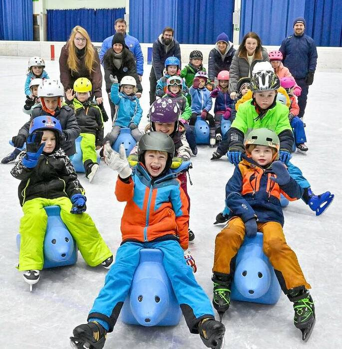

+++
title = "Sichtbares Plädoyer für den Schulsport"
date = "2024-01-15"
template = "page.html"
[taxonomies]
tags = ["Aktuelles" ,"Presse", "Sport" ]
categories = ["Sport & Gesundheit"]
+++
Garmisch-Partenkirchen – Florian Vollmer kennt die Unkenrufe: „Die Kinder bewegen sich nicht mehr, der Schulsport fällt sowieso immer aus.“ Er könnte noch ein paar aufzählen. Nur: „Das stimmt nicht“, betont der frühere Eishockeyprofi und jetzige Sportlehrer. Zumindest nicht an der Bürgermeister-Schütte-Schule im Ortsteil Partenkirchen. Dort machen sich Rektorin Stefanie Schmidt und die Fachlehrer stark für den Sport während der Schulzeit. „Er zählt bei uns definitiv etwas“, betont Schmidt. „Wir sind da sehr gut aufgestellt, haben aber auch die geeigneten Lehrkräfte dafür.“ Damit zielt sie nicht nur auf den Vollblutsportler Vollmer ab, sondern auch auf Dr. Anja Schalkhäuser-Riesch. Die ist im gesamten Schulamtsbezirk die Fachkraft für den Sportunterricht. Und sie hat in Partenkirchen schon einiges in Bewegung gesetzt.

<!-- more -->




```Mit Freude bei der Sache: die Grundschüler aus Partenkirchen. Eingefädelt haben das Angebot (h.v.l.) Ann-Cathrin Krahmer, Daniela Koch, Anton Lipf (beide SCR), Florian Vollmer, Dr. Anja Schalkhäuser-Riesch, Stefanie Schmidt und Martin Lamich (SCR). Foto: sehr```

Seit einigen Jahren läuft ein Projekt mit dem Skiclub Partenkirchen. „Nordic für fun“ lautet das Motto. Das Angebot richtet sich an die Schüler der zweiten Klassen. Langlaufen steht auf dem Unterrichtsplan. Schalkhäuser-Riesch hat die Kooperation an Land gezogen. „Ich denke, das ist eine Win-Win-Situation“, urteilt die Rektorin. Für Schule und Verein. „Wir wollen die Kinder stark machen, aber auch Nachwuchs für die Vereine rekrutieren.“ Und das eben in Sportarten, die nicht ganz so alltäglich sind oder nicht so leicht erschwinglich für jedermann. Wie Eishockey, Ski alpin oder Langlauf. „Es gibt auch Kinder, die aus einem schwächeren sozialen Umfeld kommen, und ich finde es super, wenn wir ihnen ermöglichen können, an diesen Sportarten teilzuhaben.“

Für die ersten Klassen hat Vollmer nun ein Eislauf-Projekt gestartet. Naheliegend. Schließlich ist der 39-Jährige seit jüngstem Alter auf Schlittschuhen unterwegs. Ein Privileg, das nicht jedes Mädchen oder jeder Bursche genießt. Sein Motto: „Wenn wir in unserer Region es nicht schaffen, den Wintersport zu integrieren, wer soll es dann tun?“ Sogar der Lehrplan beinhaltet Schlittschuhlaufen. Also ließ Vollmer seine Drähte in Richtung Eisstadion und SC Riessersee glühen. Mit Erfolg. Der Verein stellt den Kindern der Schütte-Schule sogar einen Experten zur Verfügung. Martin Lamich, Coach der U13 im Verein, geht mit den Schülern aufs Eis. „Ich finde das überragend, er ist ein ausgebildeter Trainer.“ Dazu kommen Vollmer und die Sportlehrkräfte der jeweiligen Klassen.

Vier sind das aktuell in Partenkirchen, in der Summe fast 120 Kinder also, die seit November regelmäßig aufs Eis gehen. „Alle zwei Wochen sind sie für die drei Schulstunden im Stadion, 90 Minuten davon wirklich auf dem Eis.“ Das Ganze läuft noch bis Ende März. Vollmer ist begeistert: „Die Kinder sind absolut happy, jeder macht mit.“ Und der Lerneffekt ist auch da: „Am Ende wird selbst ein absoluter Anfänger frei Schlittschuhfahren können.“

Ein schöner Nebeneffekt: Für die Mädchen und Burschen kostet der etwas andere Sportunterricht nichts. „Da helfen alle zusammen“, lobt Vollmer. Schulamt, Schule, Gemeinde und die Gemeindewerke sitzen in einem Boot. „Wir werden mit dem Ortsbus geholt und zurück zur Schule gebracht“, erläutert Vollmer. „Und die Kinder brauchen keinen Eintritt zu zahlen.“ Eine Tatsache, die auch die Rektorin herausstellt. „Die Gemeinde als unser Sachaufwandsträger unterstützt uns bestens.“

Das Sportprogramm an der Schütte-Schule weiter auszubauen, nennen die Verantwortlichen durchaus als Ziel. „Das wäre der richtige Weg“, sagt Vollmer. Denn wie sonst sollen die Kinder später in die Vereine kommen. „Im Vordergrund steht aber, dass sie Gaudi an der Bewegung haben und verstehen, dass Sport nicht in der Schule aufhört. Sie sollen Freude daran finden, auch in der Freizeit weiter zu machen.“ Denn: Natürlich reichen am Ende drei Wochenstunden in der Schule nicht. Auch Schmidt stellt klar, dass sie bereit ist, das Angebot zu erweitern. „Hervorragend wären solche Kooperationen für unsere Mittelschüler.“ Die sind ein wenig älter. „Aber sie hätten es auch notwendig.“ Immerhin: Ein Anfang ist gemacht.

Quellenangabe: Garmisch-Partenkirchner Tagblatt vom 12.01.2024, Seite 31