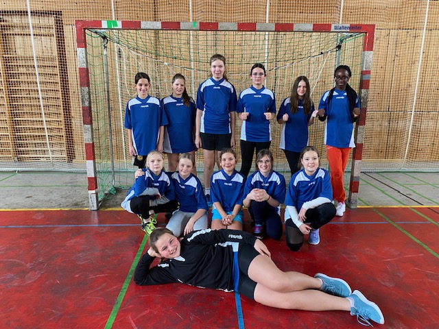

+++
title = "Dabei sein ist alles!"
date = "2024-02-07"
template = "page.html"
[taxonomies]
tags = ["Aktuelles" , "Sport" ]
categories = ["Sport & Gesundheit"]
+++
Am Dienstag, den 09.01.2024, zeigte die Bürgermeister-Schütte-Mittelschule
Partenkirchen in der Wettkampfgruppe IV (Jg. 2011 und jünger) beim
Bezirksfinale von „Jugend trainiert für Olympia“ im Handball beachtliches
Engagement. Als Vertreter des Landkreises GAP trafen die Schülerinnen auf
etablierte Mannschaften aus Unterschleißheim, Erding, Prien und Gröbenzell in
der Schulsporthalle in Gröbenzell.

<!-- more -->

Die Vorbereitung der Partenkirchnerinnen, bei der sie Fähigkeiten wie den
Stemmwurf und die Drei-Schritte-Regel verinnerlichten, spiegelte ihren starken
Willen und ihre Bereitschaft zu lernen wieder. Obwohl sie nur über geringe
Handballerfahrung verfügten, traten sie mit Entschlossenheit und einer
sichtbaren Freude am Spiel gegen die erfahrenen Vereinsspielerinnen an.
Die Partenkirchnerinnen begegneten jeder Herausforderung mit Mut und
Teamgeist, unterstützt von einer engagierten Torfrau Carolina, die
beeindruckende Paraden zeigte. Der Spielverlauf bot allen Spielerinnen
wertvolle Spielzeit und Gelegenheiten, sich zu beweisen.
Obwohl die Begegnungen mit hohen Punktzahlen für die Gymnasien aus Erding
und Unterschleißheim endeten, reflektiert das Ergebnis nicht die positive
Erfahrung des Partenkirchner Teams. Die Freude am Spiel und der
Zusammenhalt innerhalb der Mannschaft waren spürbar, sowohl auf dem
Spielfeld als auch unter den lautstarken Unterstützern.
Dieses Turnier erwies sich nicht nur als sportliches Ereignis, sondern auch als
ein wichtiger Schritt in der Teamentwicklung. Mit neu gewecktem Ehrgeiz
blicken die Schülerinnen der Bürgermeister-Schütte-Mittelschule bereits
erwartungsvoll auf das nächste Jahr und die erneute Teilnahme an „Jugend
trainiert für Olympia“.



```Betreuer: Johanna Saul
Schüler: Maxie Adam, Franziska Braun, Anna-Lena Langfeld, Carolina Monika Anna
Grasegger, Viktorija Krstova, Leia Deby, Ava Einsle, Leyla Djemili, Elsa Mehemetaj, Larissa-
Rebeca Ivan, Klara Knon, Anna Musa