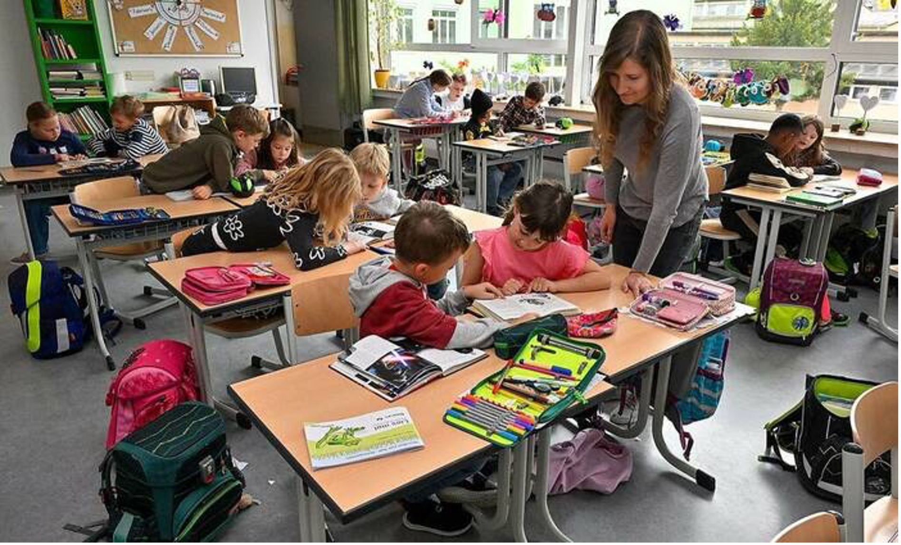

+++
title = "Englisch ganz nebenbei"
date = "2024-06-10"
template = "page.html"
[taxonomies]
tags = ["Aktuelles" , "Schulleben", "Presse" ]
# categories = ["Sport & Gesundheit" , "Kunst & Kultur"]
+++
Mindestens 20 Minuten täglich auf Englisch – das passiert an der Bürgermeister-Schütte Schule in Garmisch-Partenkirchen. Zwei Klassen werden schon nach den Vorgaben der Bilingualen Grundschule unterrichtet. Dieses Modell kommt an – bei Kindern und Eltern. Die Nachfrage ist groß.

<!-- more -->

*Der Unterricht auf Englisch ist für die Mädchen und Buben der Klasse 2d an der Bürgermeister-Schütte-Schule und Lehrerin Anna Bäumler völlig normal. Foto: Thomas Sehr*

Garmisch-Partenkirchen – Mit einem fröhlichen „Good morning“ begrüßen die Zweitklässler ihre Lehrerin. An der Tafel hängen Farbtafeln – mit den englischen Begriffen. Auch einfache Fragen oder Sätze stehen darauf. Wie’s jemandem geht oder wie sie heißen, können die Mädchen und Buben längst problemlos formulieren. Auch die Wochentage sind ihnen vertraut. Seit der ersten Klasse besuchen sie eine Bilinguale Grundschule – und lernen in zwei Sprachen. Ein Angebot, das an der Bürgermeister-Schütte-Schule in Garmisch-Partenkirchen als einziger Bildungsstätte im Landkreis sehr gut ankommt. „Das Interesse der Eltern ist sehr groß“, bestätigt Rektorin Stefanie Schmidt. Im September hätten sie sogar zwei erste Klassen nach dem bilingualen Modell bilden können. Geht aber nicht, das bayerischen Ministeriums für Unterricht und Kultus lässt nur eine zu. „Deshalb haben wir gelost“, verrät Schmidt.

Mindestens 20 Minuten lang werden die Kinder täglich auf Englisch unterrichtet. So die Vorgabe. Anna Bäumler, die Lehrerin der 2d, hält es anders. Neben dem Morgenbeginn finden bei ihr auch Mathe, Heimat- und Sachkunde sowie viel Alltagskommunikation in der Fremdsprache statt. Nach der Begrüßung und einer kurzen Leseeinheit erklingt ein Lied aus dem Soundtrack von „Forrest Gump“. Das Signal für die Grundschüler, die Bücher wegzupacken und die Hausaufgaben herzurichten. Ehe sie sich denen widmen, singen die Kinder ihr Morgenlied und fragen sich nacheinander, wie es ihnen geht. Der Großteil ist glücklich, also „happy“. Ein Mädchen ist „sad“, was traurig bedeutet. Sofort fragen seine Klassenkameraden nach: „Why?“ Der Papa sei die nächsten drei Tage weg, wird der Gemütszustand begründet. Ein anderes Kind sagt, dass es „excited“, also aufgeregt sei. Der Anlass: „Ich habe zum ersten Mal eine Eins geschrieben.“ Es ist ein lockerer, fröhlicher Einstieg in den Tag.
Gerade für Schüler mit Migrationshintergrund ist das Angebot gut. „Viele können schon Englisch“, erklärt Schmidt. „So holen wir sie ein Stück weit ab.“ Verbunden mit Erfolgserlebnissen. „Die Kinder blühen im Unterricht auf“, bestätigt Bäumler. „Endlich sind sie die, die was verstehen und können.“
Während bei ihr den ganzen Tag über immer wieder Englisch einfließt, handhabt es ihr Kollege Florian Kreuzer, der Klassleiter der 1d, anders. Er konzentriert sich auf eine etwa 20-minütige, tägliche Einheit in der Fremdsprache. Auch das ist möglich. „Dadurch, dass das erst angelaufen ist, sind wir in der Gestaltung noch ziemlich frei“, sagt Bäumler.
Das Angebot ist eine Chance für die Kinder, unterstreicht die Rektorin. „In dem Alter ist das Sprachfenster noch offen, das muss man nutzen.“ Das gelingt, wie die Rückmeldungen der Eltern zeigen. „Teilweise merken die Schüler gar nicht, was auf Englisch gemacht wurde“, sagt Bäumler. Ganz selbstverständlich gehen die Mädchen und Buben also mit der Fremdsprache um.
Wer keinen Platz in der bilingualen Klasse bekommen hat, kann seinen Nachwuchs für die Englisch AG anmelden. Zwei Stunden am Nachmittag – als Wahlfach. „Wir würden gerne noch mehr machen“, betont die Pädagogin. Leider gebe es nicht so viele Grundschullehrer, die sich für Englisch als Hauptfach entscheiden. Wer es tut, ist an der Bürgermeister-Schütte-Schule willkommen.
Im nächsten Schuljahr besteht die Bilinguale Grundschule schließlich schon aus drei Klassen. Nach Bäumler und Kreuzer übernimmt Alexandra Scherer die ABC-Schützen, die quasi nebenbei mit der Fremdsprache vertraut gemacht werden.
- von Tanja Brinkmann