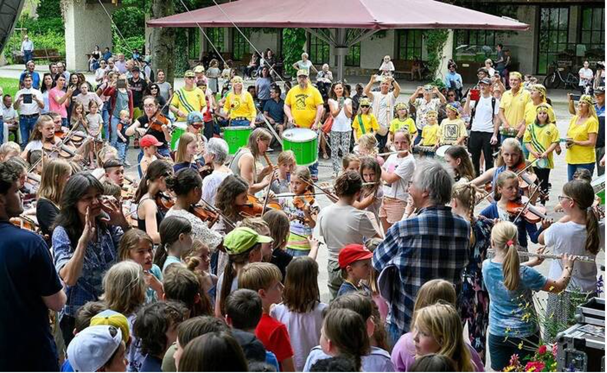

+++
title = "Gelungener Flashmob mit 400 Schülern, Drachen und jeder Menge Musik"
date = "2024-06-10"
template = "page.html"
[taxonomies]
tags = ["Aktuelles" , "Schulleben", "Presse" , "Musik"]
categories = ["Kunst & Kultur"]
+++
„Eine Insel mit zwei Bergen“ – das bekannte Lied der Augsburger Puppenkiste aus Michael Endes beliebtem Kinderstück „Jim Knopf und Lukas, der Lokomotivführer“ schallte weit über den Richard-Strauss-Platz. Streicher-, Holz- und Blechbläser-Ensemble, Sänger und Ramba-Zamba-Gruppe hatten sich zu einem Flashmob anlässlich der Richard-Strauss-Tage verabredet. Das kam auch beim Festival-Publikum bestens an. 

<!-- more -->

„Circa 400 Schüler unserer Musikschule und aus der Bürgermeister Schütte-Schule waren dabei“, sagt Musikschulleiter Jürgen Klier. Er hatte mit seinem Instrumentallehrer-Team die Idee dazu. Die Theatergruppe Creme Frech erweckte aus früheren Inszenierungen Drachenfiguren aus dem Fundus zum Leben, und so schlossen sich auch Frau Malzahn, Nepomuk, der goldene Drache und sogar der Kaiser von China dem bunten Zug in den Michael-Ende-Kurpark an. Hier warteten in der Konzertmuschel bereits Gitarrengruppe, Harfen, Kontrabässe und Hackbretter auf das gemeinsame Konzert. Eine wunderbare Aktion! msch/Fotos Sehr

