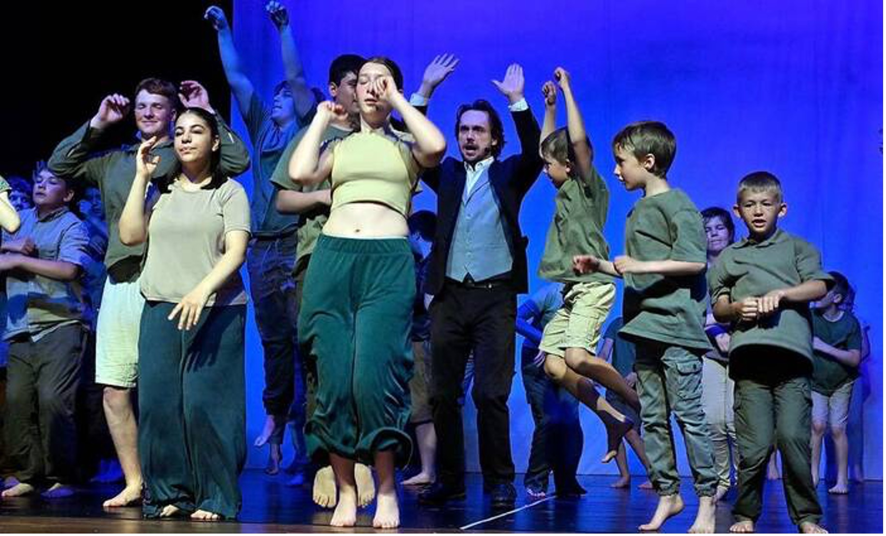

+++
title = "Umjubelte Premiere von „Hänsel und Gretel“ "
date = "2024-06-10"
template = "page.html"
[taxonomies]
tags = ["Aktuelles" , "Schulleben", "Presse" , "Tanzprojekt" ]
categories = ["Kunst & Kultur"]
+++
Garmisch-Partenkirchen – Hut ab! Das, was die Schüler der 2b mit ihrer Lehrerin Heike Hertlein-Schneider und der 7M von Andrea Rau der Bürgermeister-Schütte-Schule mit professioneller Unterstützung auf die Beine gestellt haben, verdient wirklich höchste Anerkennung. 

<!-- more -->

*Grund zum Feiern haben die jungen Darsteller und Richard Strauss alias Benedikt Ehrenberg: Die Hexe ist tot! Fröhlich tanzen sie zu „Celebration“ auf der Bühne des Festsaals Werdenfels. Fotos: Thomas Sehr* 

Ihre kurzweilige, mit vielen Überraschungen gespickte Vorstellung von „Hänsel und Gretel“ im Rahmen der Richard-Strauss-Tage in Garmisch-Partenkirchen erntete gestern Vormittag zu recht viel Applaus und Jubelrufe. Von ihrem Tanz – bei den Kindern erklang meist die Opernmusik von Engelbert Humperdinck, bei den Jugendlichen Hip-Hop- und andere moderne Klänge – ließ sich auch Strauss begeistern.
Der weltberühmte Komponist, der 1893 die Uraufführung von „Hänsel und Gretel“ in Weimar dirigiert hatte, begleitete das Geschehen mit großem Interesse. Benedikt Ehrenberg, ein Ensemblemitglied des Kleinen Theaters, verkörperte den Tondichter mit viel Enthusiasmus. Zeigte er sich bei „Wake up“, das passend zum Auftritt des Taumännchens lief, noch etwas entsetzt vom Tanz der jungen Akteure, stand er bei „Celebration“ mitten unter ihnen und hüpfte begeistert mit.
Klar musste gefeiert werden, dass der Hexe der Garaus gemacht wurde. Denn das passiert auch in der Oper. Über den Unterschied zwischen dem Musiktheater und dem Märchen tauschten sich immer wieder Kinder und Jugendliche aus. Eindrucksvoll, dass sie bei ihren Sprechrollen genau wie beim Tanz und bei den Umbau-Phasen voll konzentriert blieben. Auch durch die begeisterten Rufe von jüngeren Geschwisterkindern, die euphorisch nach dem großen Bruder oder der Schwester schrien, ließ sich niemand aus der Ruhe bringen. Hut ab vor dem, was die Schüler mithilfe der Tanzlehrerinnen Lisa Haug und Mia Sophie Glas, der Theaterpädagogin Angela Hundsdorfer, der Künstlerin Manuela Dilly und von Jo Jonietz, der das Foto- und Videoprojekt leitet, geleistet haben. Zwischen den Klassen ist ein tolles Miteinander entstanden. Das wollte der Kiwanis-Club, der das Projekt gefördert hat, erreichen. Außerdem ging es um die Vermittlung von Kultur. Beides ist aufgegangen.

- von Tanja Brinkmann
