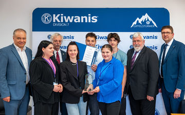

+++
title = "Jugend übernimmt Verantwortung"
date = "2024-06-25"
template = "page.html"
[taxonomies]
tags = ["Aktuelles" , "Schulleben", "Presse", "Kiwanis" ]
categories = ["Nachhaltigkeit & Ressourcen"]
+++
KIWANIS GIPFELSTÜRMER AWARD - Klasse 10M der BürgermeisterSchütte-Schule gewinnt zweiten Preis

Garmisch-Partenkirchen – Die Verleihung des Kiwanis Gipfelstürmer Awards 2024 fand wieder im Bayerischen Landtag in München statt. Der mit 4000 Euro dotierte Preis geht an Kinder und Jugendliche, die sich in ihrer Freizeit für die Allgemeinheit, die Umwelt oder andere Menschen einsetzen. „Es ist schon mehr als beeindruckend, wie viele Schüler sich ehrenamtlich für andere Menschen oder sogar für unsere Gesellschaft engagieren“, betonte Harald Kühn (CSU), Landtagsabgeordneter für die Landkreise Garmisch-Partenkirchen und Weilheim-Schongau. Er freute sich besonders, dass unter den Preisträgern auch sein Stimmkreis vertreten ist.

<!-- more -->

Den zweiten Platz teilen sich heuer zwei Bildungseinrichtungen – eine aus dem niederbayerischen Riedenburg sowie die Bürgermeister-Schütte-Grundund Mittelschule in Garmisch-Partenkirchen mit dem Projekt „Schnell daher gesagt – was nun?“. „Dieses soll die bewusste Kommunikation innerhalb der Schülerschaft verbessern und den achtsamen Umgang miteinander fördern“, erklärt Peter Bitzl, Präsident des Kiwanis-Clubs Garmisch-Partenkirchen. Unter anderem standen Befragungen der Lehrer, Umfragen unter den Schülern, Sprechstunden, Motto-Tage, Workshops, Streitschlichter-Aktionen und politische Bildung auf der Agenda der Klasse 10M. Die Jugendlichen wollen als Vorbilder auftreten und als Tutoren ihre Mitschüler unterstützen – und das nachhaltig. Die dabei entwickelten Ideen und Maßnahmen werden zur Freude aller Beteiligten im kommenden Schuljahr von der jetzigen Klasse 9M weitergeführt.

„Gerade in der heutigen Zeit brauchen wir als demokratisches Land junge und engagierte Menschen, die mehr tun als ihre Pflicht“, sagte Kühn. Oftmals scheine es, dass die heutige Jugend andere Werte habe und sich nur noch um sich selbst kümmere. „Deshalb tut es gut, zu sehen, dass es nicht so ist, und auch deshalb freut es mich, dass ich die Kiwanier unterstützen kann, im Maximilianeum eine würdige Veranstaltung zu organisieren.“ Den beteiligten Kiwanis- Clubs aus Viechtach, Straubing, Regensburg, Bad Aibling, Garmisch-Partenkirchen sowie der Kiwanis-Foundation war es Lieutenant Governor Thomas Quiram zufolge wichtig, „denjenigen eine Plattform zu geben, die sich bereits als Kinder oder Jugendliche für andere Menschen einsetzen“. Die Unwetter der vergangenen Wochen haben gezeigt, wie wichtig das Ehrenamt ist und was ehrenamtlich tätige Menschen alles bewegen können: „Sie sind die Stütze unserer Gesellschaft.“ 

Zum zweiten Platz gratulieren die Landtagsabgeordneten Harald Kühn (CSU, l.) und Sebastian
Friesinger (CSU, 2.,v. r.) sowie Peter Bitzl (3. v. l.) und Thomas Quiram (r.) von Kiwanis den Preisträgern (ab 2. v. l.) Giulia Ungureanu, Dorka Kanya, Lorjan Blakaj, Vanessa Bischof und Leonhard
Paglia. Foto: mike@samplay.de
