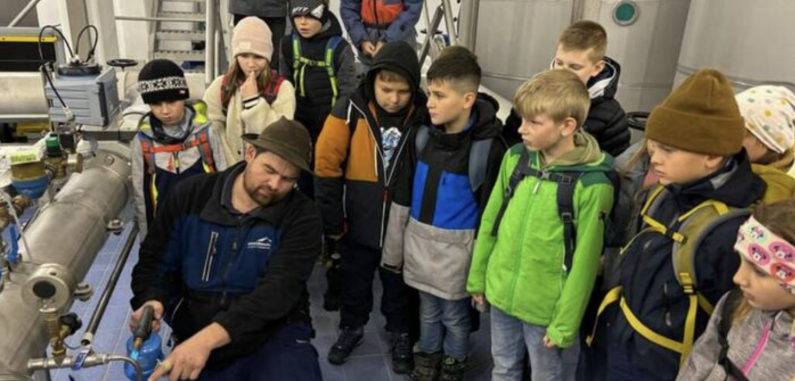

+++
title = "Spannender Unterricht beim Wassermeister"
date = "2024-07-15"
template = "page.html"
[taxonomies]
tags = ["Aktuelles" , "Schulleben", "Presse"]
categories = ["Nachhaltigkeit & Ressourcen"]
+++
Dreht man den Hahn daheim auf, kommt frisches Wasser in hervorragender Qualität heraus. Wie das funktioniert und woher das Trinkwasser von Garmisch-Partenkirchen, Grainau und Farchant kommt, erfuhren Viertklässler der Bürgermeister-Schütte-Schule von Jakob Mangold (v.l.) bei einer circa zweistündigen Führung.

<!-- more -->

Der Wassermeister der Gemeindewerke zeigte den Mädchen und Buben unter anderem, wie Proben zur Qualitätskontrolle genommen werden. Zudem informierte er sie über die Wassergewinnung, die Aufbereitung, die Speicherung und die Verteilung an den Endkunden.
RED/FOTO: GEMEINDEWERKE

