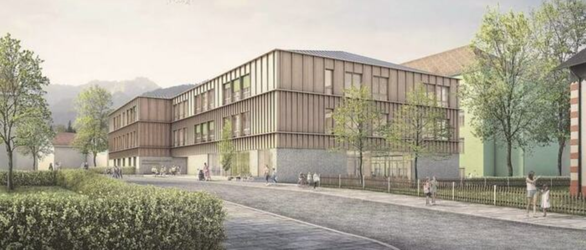

+++
weight = 1
date = "2024-10-15"
title = "Großes Renovierungsprojekt an der Bürgermeister-Schütte-Schule"
template = "page.html"
[taxonomies]
tags = [ "Aktuelles" , "Schulleben"]
categories = ["Nachhaltigkeit & Ressourcen"]
+++
# 30 Millionen Euro Investition in unsere Zukunft

Liebe Schülerinnen und Schüler,   
Eltern und Interessierte,

wir freuen uns, Sie über ein bedeutendes Projekt an unserer Bürgermeister-Schütte-Schule zu informieren. In den kommenden Jahren wird unsere Schule einer umfassenden Renovierung und Erweiterung unterzogen. Dieses Großprojekt, mit einem Investitionsvolumen von mindestens 30 Millionen Euro, wird unsere Lernumgebung grundlegend verbessern und modernisieren.

<!-- more -->

## Neubau der Grundschule

Der erste Schritt dieses ambitionierten Vorhabens ist der Neubau unserer Grundschule. Die Arbeiten haben bereits begonnen, und wir rechnen mit der Fertigstellung im Sommer 2027. Das neue Gebäude wird zwischen der Hindenburg- und Münchner Straße entstehen und bietet innovative Lernräume für unsere jüngsten Schüler.

### Highlights des Neubaus:
- Moderne Hybridbauweise aus Beton und Holz
- Photovoltaik-Anlage auf dem Dach für nachhaltige Energieversorgung
- Innovative Cluster-Raumkonzepte für ein verbessertes Lernumfeld
- Offene Lehrzonen für mehr Zusammenarbeit und kürzere Wege

## Herausforderungen und Lösungen

Wir sind uns bewusst, dass die Bauarbeiten vorübergehende Einschränkungen mit sich bringen werden. Insbesondere die Parksituation wird sich in den kommenden Jahren verschärfen. Wir bitten alle Eltern und Lehrkräfte um Verständnis und Kooperation. Bitte nutzen Sie, wenn möglich, alternative Verkehrsmittel wie das Fahrrad oder lassen Sie Ihre Kinder in den umliegenden Seitenstraßen aussteigen.

## Ausblick

Nach Abschluss der Grundschule steht die Sanierung der Mittelschule auf dem Programm. Auch die dringend benötigte Renovierung der Sporthalle bleibt auf unserer Agenda, auch wenn sie zunächst zurückgestellt wurde.

Wir danken Ihnen für Ihr Verständnis und Ihre Unterstützung während dieser spannenden Umbruchphase. Gemeinsam schaffen wir eine moderne Lernumgebung, die unseren Schülerinnen und Schülern die besten Voraussetzungen für ihre Zukunft bietet.

Bleiben Sie informiert! Wir werden Sie regelmäßig über den Fortschritt der Bauarbeiten auf dem Laufenden halten.

Ihre Schulleitung

{{downloads(folder="downloads")}}
