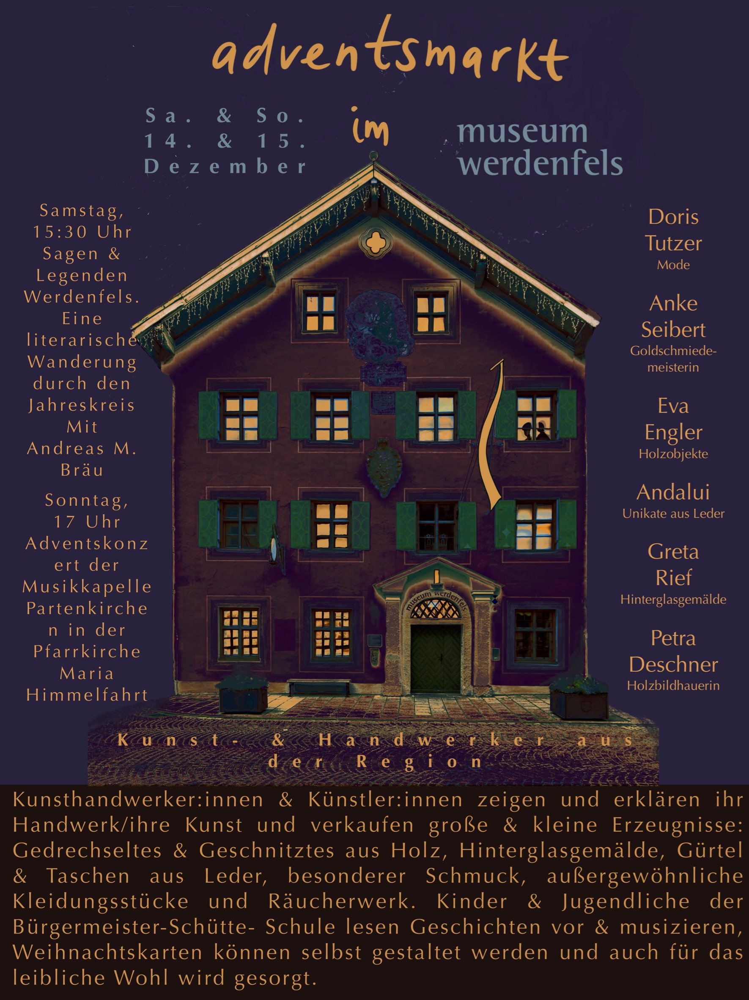

+++
weight = 1
date = "2024-11-01"
title = "Adventsmarkt"
template = "page.html"
[taxonomies]
tags = [ "Aktuelles" , "Schulleben"]
+++
# Vorweihnachtlicher Zauber im Museum Werdenfels

<!-- more -->

Am 14. und 15. Dezember verwandelt sich das historische Museum Werdenfels in einen bezaubernden Adventsmarkt der besonderen Art.

Regionale Kunsthandwerkerinnen und Künstler präsentieren in dem stilvollen Ambiente ihre handgefertigten Schätze: Von kunstvoll gedrechselten Holzobjekten über ausdrucksstarke Hinterglasgemälde bis hin zu edlen Lederwaren und außergewöhnlichen Modestücken findet sich hier eine erlesene Auswahl an hochwertiger Handwerkskunst.

Das Rahmenprogramm verspricht besondere Höhepunkte: Am Samstag entführt Andreas M. Bräu die Besucher um 15:30 Uhr auf eine literarische Wanderung durch Sagen und Legenden der Region. Den musikalischen Abschluss bildet am Sonntag um 17 Uhr ein festliches Adventskonzert der Musikkapelle Partenkirchen in der Pfarrkirche Maria Himmelfahrt.
Für die kleinen Gäste lesen Schüler der Bürgermeister-Schütte-Schule Geschichten vor und musizieren. Kreative können selbst Weihnachtskarten gestalten. Natürlich ist auch für das leibliche Wohl gesorgt – der perfekte Rahmen für einen stimmungsvollen Adventsnachmittag für die ganze Familie.

Der Adventsmarkt bietet damit eine gelungene Mischung aus traditionellem Handwerk, Kultur und vorweihnachtlicher Atmosphäre im historischen Ambiente des Museums Werdenfels.

