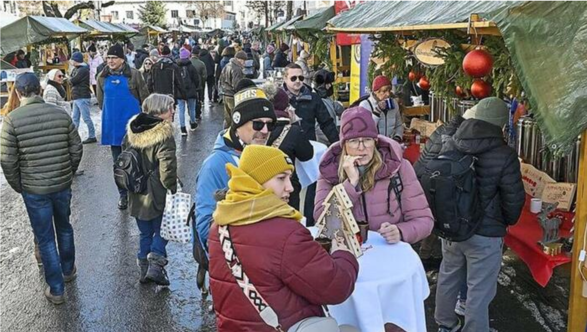

+++
title = "50 Jahre Caritativer Weihnachtsmarkt: Eine Tradition"
date = 2024-11-25
[taxonomies]
tags = [ "Aktuelles", "Schulleben", "karitativ" ]
+++

## Ein Jubiläum voller Herzenswärme

In Garmisch-Partenkirchen feiert der caritative Weihnachtsmarkt in diesem Jahr ein besonderes Jubiläum: 50 Jahre Engagement für den guten Zweck. Und mittendrin: die Bürgermeister-Schütte-Schule, die mit kreativer Handarbeit und Herzblut den Markt bereichert.

<!-- more -->

### Kreative Kinderkunst

Die Drittklässlerin Sina (8) erzählt stolz: „Wir haben Zwerge aus Kindersöckchen gemacht!" An ihrem Schulstand präsentiert sie mit Begeisterung die kuscheligen, bärtigen kleinen Gesellen. Es ist genau diese Mischung aus Kreativität und sozialem Engagement, die den Weihnachtsmarkt so besonders macht.

## Die Ursprünge einer besonderen Tradition

Die Initiative für diesen besonderen Markt ging ursprünglich von Schülerinnen von St. Irmengard aus, doch die Bürgermeister-Schütte-Schule hat die Tradition des gemeinnützigen Schaffens längst zu ihrer eigenen gemacht. Lange vor dem Markt beginnt für die Schüler die Vorbereitungszeit - mit Basteln, Werken und dem Erschaffen einzigartiger Unikate.

## Ein Markt mit Herz

Heute, 50 Jahre nach der ersten Veranstaltung, umfasst der caritative Weihnachtsmarkt 30 Stände, betreut von 26 verschiedenen Institutionen. Die Bürgermeister-Schütte-Schule ist dabei nicht nur Teilnehmer, sondern ein Herzstück des Marktes.

### Vielfalt und Engagement

Die Bandbreite der Angebote ist beeindruckend:
- Selbstgebastelte Zwerge aus Kindersöckchen
- Kreative Werkarbeiten der Schüler
- Adventliche Dekorationen
- Unikate, die Kinderhand geschaffen hat

## Eine Gemeinschaft, die zusammenhält

Bürgermeisterin Elisabeth Koch betonte die Bedeutung dieser Veranstaltung. Die Schüler der Bürgermeister-Schütte-Schule zeigen dabei eindrucksvoll, wie Kinder bereits früh lernen können, was Solidarität und soziales Engagement bedeuten.

### Kulturelles Rahmenprogramm

Der Markt wird musikalisch umrahmt, die Schüler bringen ihre eigene, unverwechselbare Energie mit - kreativ, enthusiastisch und voller Vorfreude auf Weihnachten.

### Die Teilnehmer
Bayerisches Rotes Kreuz, Seniorentreff Marianne Aschenbrenner, Katholi-
scher Mütterverein, St. Irmengard-Schulen, Bürgermeister-Schütte-Schule,
Waldkindergarten, Integrationskindergarten, Landesbund für Vogelschutz,
Tierschutzverein Garmisch-Partenkirchen, Inner Weel Club, Rotary Club
Garmisch-Partenkirchen, Kiwanis, Zonta-Club, VTV „Die Werdenfelser“ Par-
tenkirchen, Weltladen, BRK-Wasserwacht Mittenwald, THW, Hobbykünstler-
stände von Hildegard Hammerle, Ingrid Jaud, Lisa Fäller, Ilona Geidner, Rose-
marie Kleier, Uschi Mück, Sabine Fäller (Hospizverein), Doris Bäumer, Freun-
deskreis Obdachlosenhilfe GaPa e.V.

## Praktische Informationen

- **Ort**: Strauss-Platz, Garmisch-Partenkirchen
- **Zeitraum**: Täglich bis 23. Dezember
- **Öffnungszeiten**: 12-20 Uhr (freitags bis 21 Uhr)

Der caritative Weihnachtsmarkt ist mehr als nur eine Verkaufsveranstaltung - er ist ein Ausdruck von Solidarität, Gemeinschaft und der wunderbaren Tradition des Gebens, angeführt von engagierten Schulen wie der Bürgermeister-Schütte-Schule.

{{downloads(folder="downloads")}}
