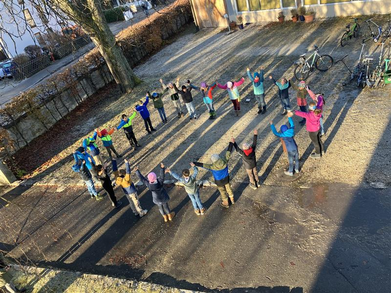

+++
title = "Die Friedenshörnchen bekommen wieder Verstärkung"
date = 2024-12-05
[taxonomies]
tags = ["Aktuelles", "Schulleben", "Friedenshörnchen"]
categories = ["Jugendsozialarbeit an Schulen"]
klassen = ["03. Klasse"]
+++

<!-- more -->

Der Jubel war groß als 32 Drittklasskinder von Frau Klarmann und Frau Grasegger - den beiden JaS-Fachkräften der Grundschule (Caritas) - erfuhren, dass sie ab sofort alle „Friedenshörnchen“ sind. Die motivierten Grundschüler absolvierten alle erfolgreich die Ausbildung zur Streitschlichtung an der Grundschule und nahmen entweder am Montag in den Allerheiligenferien oder am Buß- und Bettag an dieser Schulung teil.
In Kleingruppen sind die „Friedenshörnchen“ nun in den Pausen unterwegs und freuen sich schon darauf, Streitigkeiten unter ihren Mitschülern gemeinsam gut zu lösen. Ausgestattet mit ihren Erkennungszeichen und ihrer Box, die mit sämtlichen Materialien bestückt ist, die die Kinder zum Streitschlichten brauchen, können es die Grundschüler kaum erwarten, die ersten Konflikte zu klären. Als Mediator führen die Drittklässler die Streitenden immer einen Schritt weiter aufeinander zu und bauen so eine „Friedensbrücke“ zwischen den Konfliktparteien – so lange bis der eine für alle passende Lösung gefunden wird. 
Den JaS-Fachkräften ist es im Rahmen der Ausbildung immer wichtig, den Kindern wesentliche Kompetenzen des Konfliktmanagements an die Hand zu geben und die sozialen Fähigkeiten der Heranwachsenden zu schulen. Denn gewiss gehören Meinungsverschiedenheiten, Missverständnisse und Streitigkeiten zu unser aller Alltag. Und dennoch ist es ganz wesentlich, wie solchen Unstimmigkeiten im Schul- und Familienalltag begegnet wird und ob friedliche Lösungen gefunden werden.
Die JaS-lerinnen sind sich sicher, dass sich auch die bereits im vergangenen Schuljahr ausgebildeten Viertklässler genauso über „neue Gesichter“ und eine so große Verstärkung im Friedenhörnchen-Team freuen, wie sie selbst!
Danke, dass ihr dabei wart und wir gemeinsam tolle Tage bei Pizza, Spaß und Lernen verbringen durften! 😊
