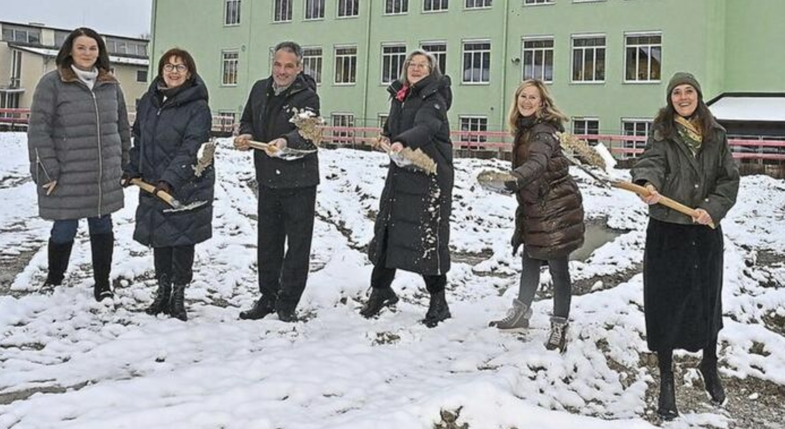

+++
title = "Spatenstich: Der 'Affenkäfig' ist schon weg"
date = 2024-12-17
[taxonomies]
tags = ["Aktuelles", "Schulleben"]
+++

<!-- more -->

# Spatenstich für die neue Schütte-Schule: Ein Meilenstein in Garmisch-Partenkirchen
Am 12. Dezember 2024 fand der symbolische Spatenstich für ein großes Schulprojekt statt: Die Bürgermeister-Schütte-Schule in Garmisch-Partenkirchen steht vor einer umfassenden Transformation.
## Projekt im Überblick
Das Großprojekt umfasst den Neubau der Grundschule und die Sanierung der Mittelschule bis Sommer 2027. Die geschätzten Baukosten belaufen sich auf bis zu 30 Millionen Euro.
### Neubau der Grundschule
Die neue Grundschule wird ein innovatives Gebäudekonzept haben:

- Erdgeschoss aus Beton
- Obergeschoss aus Holz
- Klassenzimmer in Cluster-Form mit gemeinsamem Flur
- Mehrere Rückzugsorte für Schüler

### Sanierung der Mittelschule
Parallel zur Neubaumaßnahme wird die Mittelschule modernisiert:

- Einbau eines Aufzugs für Barrierefreiheit
- Modernisierung der Klassenzimmer

###  Beteiligte Personen
An dem Spatenstich nahmen teil:

Stefanie Schmidt (Rektorin)
Ulrike Bittner-Wolf (SPD-Gemeinderätin)
Anton Buchwieser (CSU-Gemeinderat)
Onni Rebholz (Architektin)
Elisabeth Koch (CSU-Bürgermeisterin)
Claudia Zolk (CSB-Bürgermeisterin)

## Ausblick
Die ersten Grundschüler sollen bereits zum Schuljahr 2027/28 in dem neuen Gebäude unterrichtet werden. Die Verantwortlichen hoffen zudem auf Fördergelder vom Freistaat.
Der "Affenkäfig" - der bisherige Sportplatz - ist bereits verschwunden, und im Frühjahr 2025 soll der Rohbau beginnen.

{{downloads(folder="downloads")}}