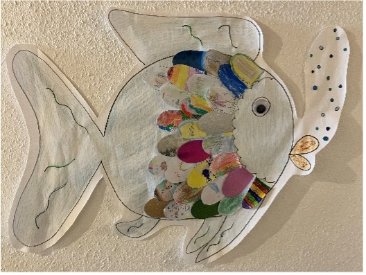

+++
title = "JaS lernt die ersten Klassen kennen"
date = 2024-12-17
[taxonomies]
tags = ["Aktuelles", "Schulleben"]
categories = ["Jugendsozialarbeit an Schulen"]
klassen = ["01. Klasse"]
+++

<!-- more -->

# JaS lernt die ersten Klassen kennen
An der Bürgermeister Schütte Grundschule wurden im September 75 Kinder eingeschult.
Die beiden Jugendsozialarbeiterinnen der Caritas, Elisabeth Grasegger und Veronika Klarmann waren sehr gespannt darauf die neuen Erstklässler und Erstklässlerinnen kennenzulernen und haben die Kinder in ihren Klassenzimmern besucht. 
Nacheinander haben sich in der jeweiligen Klasse alle Mädchen und Jungen mit Namen vorgestellt und anhand von „Stein und Feder“ beschrieben wie es ihnen zum Schulanfang geht. Die Gemütslagen haben von „Federleicht“ bis „Beschwerlich“ alles abgedeckt. Dadurch wurden unterschiedliche Themen angesprochen, die die Kinder beschäftigen. Einige davon haben sich auch in den jeweiligen Büchern, welche die beiden Sozialpädagoginnen mitgebracht haben wiedergefunden.
Die ausgewählten Geschichten sollten einen kleinen Einblick gewähren, welche Inhalte bei Frau Grasegger und Frau Klarmann ihren Platz finden können.
So wurde in der Klasse 1a das Buch „Das Farbenmonster“ vorgelesen. Alle waren aufgeregt und wollten in der ersten Reihe sitzen, da es sich bei diesem Buch um eine Pop-up-Version handelte. Die Kinder haben die unterschiedlichen Gefühle kennengelernt und durch das Erstellen einer persönlichen Fellzacke ist das ganz besondere Farbenmonster der Klasse entstanden. Es macht deutlich, dass jedes Gefühl der Kinder Platz in unserer Schule hat.
Auch in der Klasse 1b hörten alle gespannt zu, als das Buch „Der Regenbogenfisch“ vorgelesen wurde. Die Kinder konnten die Geschichte im Anschluss gut wiedergeben und erzählten daraufhin von ihren Freundschaften. Indem alle Schüler und Schülerinnen eine persönliche Schuppe gestalteten, hat sich ein großer Regenbogenfisch ergeben, der das bunte Miteinander der Klasse deutlich macht.
Dem Buch „Elmar“ durfte die Klasse 1c lauschen.  Vor allem das farbenfrohe Äußere des Elefanten hat die Kinder begeistert. Das Anderssein des Tieres hat zu viel guter Laune geführt und alle waren sich einig, dass sie die vielfältige Figur gernhaben. Wie abwechslungsreich die Klasse selbst ist, zeigt der kunterbunte Elefant, der durch die Schüler und Schülerinnen geschaffen wurde.
 
Alle drei entstandenen Klassenkunstwerke haben ihren Platz neben den Büroräumen der beiden Jugendsozialarbeiterinnen gefunden und können jederzeit bestaunt werden.
Frau Grasegger und Frau Klarmann freuen sich auf das Schuljahr mit allen Kindern und den bunten Themen, Gefühlen und Geschichten, die auf sie warten.

{{downloads(folder="downloads")}}