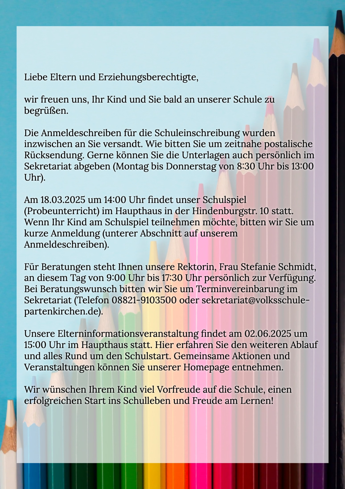

+++
title = "Informationen zur Schuleinschreibung 2025"
date = 2025-03-01
[taxonomies]
tags = ["Aktuelles", "Schulleben", "Schuleinschreibung", "Infos zum Schulanfang
 "]
+++
## Liebe Eltern und Erziehungsberechtigte,

wir freuen uns, Ihr Kind und Sie bald an unserer Schule zu begrüßen.

<!-- more -->

Die Anmeldeschreiben für die Schuleinschreibung wurden inzwischen an Sie versandt. Wie bitten Sie um zeitnahe postalische Rücksendung. Gerne können Sie die Unterlagen auch persönlich im Sekretariat abgeben (Montag bis Donnerstag von 8:30 Uhr bis 13:00 Uhr).

Am 18.03.2025 um 14:00 Uhr findet unser Schulspiel (Probeunterricht) im Haupthaus in der Hindenburgstr. 10 statt. Wenn Ihr Kind am Schulspiel teilnehmen möchte, bitten wir Sie um kurze Anmeldung (unterer Abschnitt auf unserem Anmeldeschreiben). 

Für Beratungen steht Ihnen unsere Rektorin, Frau Stefanie Schmidt, an diesem Tag von 9:00 Uhr bis 17:30 Uhr persönlich zur Verfügung. Bei Beratungswunsch bitten wir Sie um Terminvereinbarung im Sekretariat (Telefon 08821-9103500 oder sekretariat@volksschule-partenkirchen.de).

Unsere Elterninformationsveranstaltung findet am 02.06.2025 um 15:00 Uhr im Haupthaus statt. Hier erfahren Sie den weiteren Ablauf und alles Rund um den Schulstart. Gemeinsame Aktionen und Veranstaltungen können Sie unserer Homepage entnehmen.

Wir wünschen Ihrem Kind viel Vorfreude auf die Schule, einen erfolgreichen Start ins Schulleben und Freude am Lernen!

{{downloads(folder="downloads")}}

