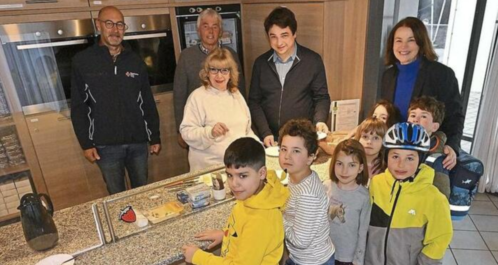

+++
title = "Schulfrühstück – ein guter Start in den Tag"
date = 2025-01-15
[taxonomies]
tags = ["Aktuelles", "Schulleben", "Schulfrühstück"]
+++

# Schulfrühstück – ein guter Start in den Tag
An der Bürgermeister-Schütte-Grund- und Mittelschule in Garmisch-Partenkirchen wird seit dem Schuljahr 2023/24 ein besonderes Angebot für Schülerinnen und Schüler bereitgestellt: An drei Tagen in der Woche (Dienstag, Mittwoch und Donnerstag) können die Kinder ab 7 Uhr in der Mensa ein kostenloses Frühstück genießen.

<!-- more -->

## Organisation und Unterstützung
Das Projekt wird durch mehrere Partner ermöglicht:

Die Frühstückshilfe des Bayerischen Lehrer- und Lehrerinnenverbandes
Den Förderverein der Schule
Das Bayerische Rote Kreuz

Als "Frühstückslotsin" sorgt Angela Klotz für die Organisation und Aufsicht. Sie versorgt die Kinder mit Tee und Semmeln und schafft eine familiäre Atmosphäre.
Zukunftspläne und Unterstützungsbedarf
Das erfolgreiche Projekt soll weitergeführt werden. Zusätzlich plant die Schule Unterstützung bei Schwimmkursen für die 1. und 2. Klassen der Grundschule.
Da die finanziellen Mittel des Fördervereins begrenzt sind, freut sich dieser über Spenden und weitere Unterstützung, um diese wichtigen Angebote aufrechterhalten zu können.

{{downloads(folder="downloads")}}