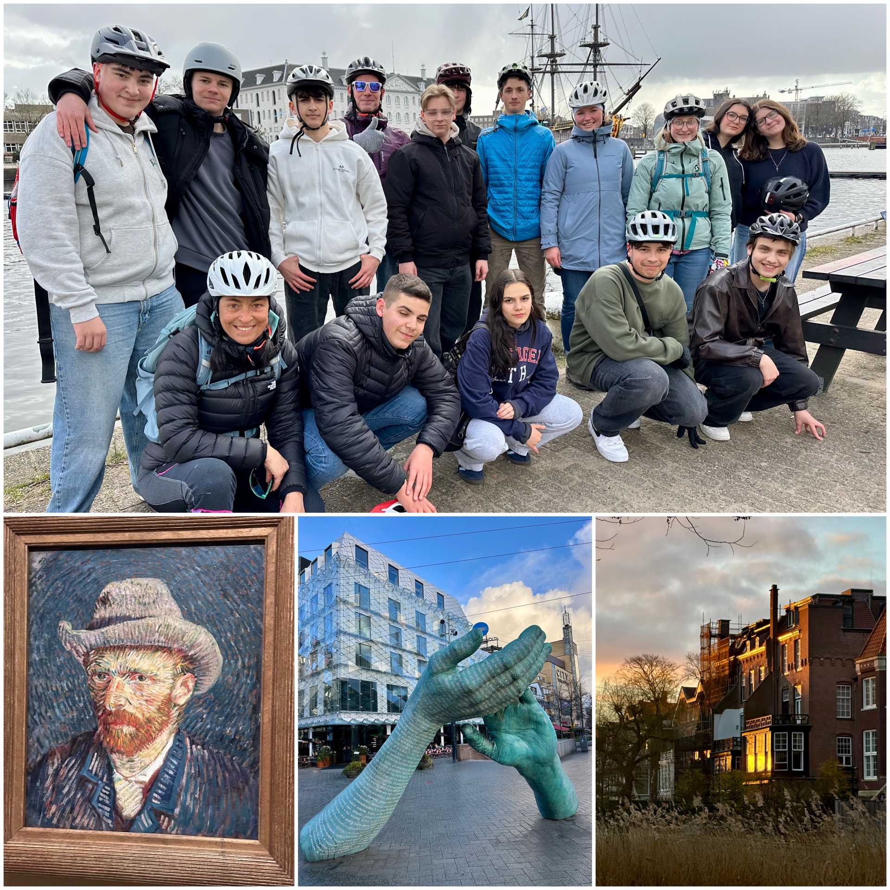

+++
title = "Abschlussfahrt der Klasse 10M "
date = 2025-03-18
[taxonomies]
tags = ["Aktuelles", "Schulleben", "Abschlussfahrt"]
klassen = ["10. Klasse"]
categories = ["Kunst & Kultur"]
+++

# Unvergessliche Abschlussfahrt der Klasse 10M nach Amsterdam
In der letzten Woche erlebte die Klasse 10M der Bürgermeister-Schütte-Schule Garmisch-Partenkirchen eine aufregende und lehrreiche Abschlussfahrt nach Amsterdam. Begleitet von dem Lehrer Robert Rauch und der Konrektorin Sonja Ermer, verbrachten die Schülerinnen und Schüler eine unvergessliche Woche in der niederländischen Hauptstadt.

<!-- more -->

Die Reise begann mit einem Besuch im berühmten Madame Tussauds, wo die Schüler die Wachsfiguren ihrer Lieblingsstars bewundern konnten. Ein weiteres Highlight war die Grachtenrundfahrt, die den Teilnehmern einen einzigartigen Blick auf die malerischen Kanäle und die beeindruckende Architektur der Stadt bot.

Aktiv wurde es bei der Fahrradtour durch Amsterdam, die den Schülern die Möglichkeit gab, die Stadt auf zwei Rädern zu erkunden. Auch der Besuch des Van Gogh Museums war ein kulturelles Erlebnis, das die Schüler in die faszinierende Welt des berühmten Künstlers eintauchen ließ.

Neben den kulturellen Aktivitäten kam auch das leibliche Wohl nicht zu kurz. Die Schüler hatten die Gelegenheit, verschiedene Käsesorten zu kosten und typische niederländische Gerichte zu testen, was für viele ein kulinarisches Highlight darstellte.

Der Vondelpark, ein beliebter Erholungsort in Amsterdam, bot den Schülern die Möglichkeit, sich zu entspannen und die gute Laune in der Gruppe zu genießen. Die positive Stimmung und der Zusammenhalt der Klasse trugen dazu bei, dass diese Abschlussfahrt zu einem unvergesslichen Erlebnis wurde.

Insgesamt war die Woche in Amsterdam ein voller Erfolg und wird den Schülerinnen und Schülern der Klasse 10M noch lange in Erinnerung bleiben.
