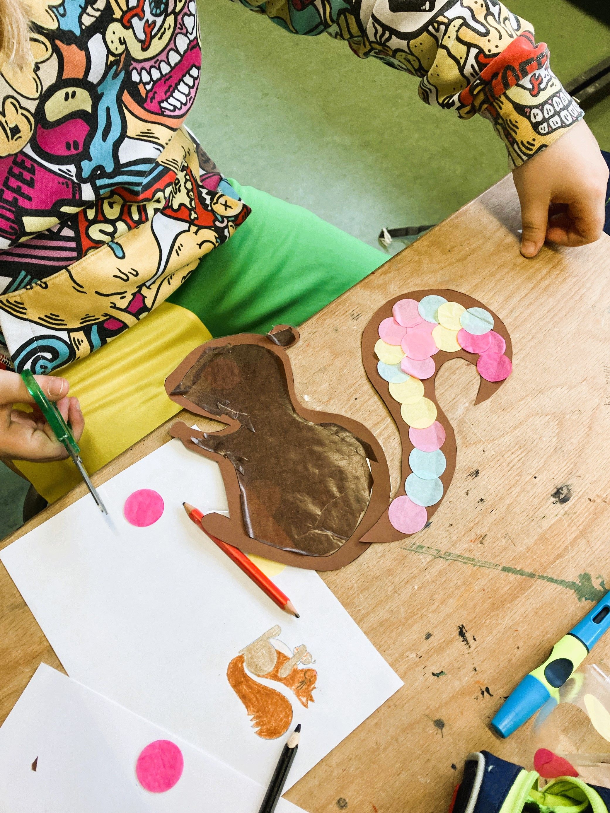

+++
title = "Die \„Friedenshörnchen\“ machen Werbung für sich"
date = 2025-04-04
[taxonomies]
tags = ["Aktuelles", "Schulleben"]
categories = ["Jugendsozialarbeit an Schulen"]
+++

<!-- more -->
„Konfetti, Glitzer und viel Spaß“ – Das klingt im ersten Moment zwar nach Fasching, Maschkera und
Karneval. Aber auch nach den Friedenshörnchen, nach Kreativsein und nach einem lustigen
Nachmittag mit den zu Streitschlichterinnen und Streitschlichtern ausgebildeten Drittklasskindern.
Die Friedenshörnchen sind sehr engagiert und unterstützen mit der Friedensbrücke ihre
Mitschülerinnen und Mitschüler in den Pausen gerne bei einer konstruktiven Konfliktlösung. Jedoch
verspüren die Streitschlichterinnen und Streitschlichter immer mehr das Gefühl, dass sie zu wenig
bekannt sind und die Kinder im Falle eines Konfliktes nur selten an die Friedenshörnchen denken,
sondern im ersten Schritt meistens zu den Erwachsenen gehen und dort Hilfe suchen.
Das möchte das Friedenshörnchen-Team so natürlich nicht länger hinnehmen und auf jeden Fall
ändern! 😊 Deshalb haben sich die Kinder gemeinsam verschiedene Dinge überlegt, um sich als
Friedenshörnchen bekannt zu machen: Wir machen Durchsagen, gehen in Kleingruppen durch die
Grundschulklassen und stellen uns mit unserem Maskottchen persönlich vor, außerdem soll unsere
Pinnwand schöner werden.
So traf sich am Dienstag vor den Faschingsferien eine Gruppe von Kindern mit Frau Klarmann und Frau
Grasegger, den beiden Jugendsozialarbeiterinnen an der Grundschule (Caritas), zu einem
kunterbunten und fröhlichen Bastelnachmittag. Mit tollen Ergebnissen, die sich jeden Fall sehen lassen
können und im Eingangsbereich unserer Grundschule auf die Friedenshörnchen aufmerksam machen.