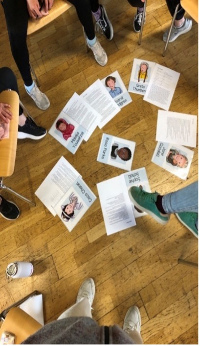

+++
title = "Projekt 'Starke Mädchen' – Zwei Tage für Selbstvertrauen und Freundschaft"
date = 2025-05-05
[taxonomies]
tags = ["Aktuelles", "Schulleben"]
categories = ["Jugendsozialarbeit an Schulen"]
+++

In den Osterferien fand das Projekt Starke Mädchen statt – zwei intensive Tage, an denen sich alles um Selbstvertrauen, Selbstbehauptung und Freundschaft drehte. 

<!-- more -->

Das Projekt bot den Mädchen aus der Bürgermeister-Schütte-Schule und aus dem Gröben die Möglichkeit, sich intensiv mit ihrer eigenen Stärke und dem Umgang mit Freundschaften auseinanderzusetzen.
Am ersten Tag reflektierten die Teilnehmerinnen ihre persönlichen Stärken und Fähigkeiten. Unterstützt wurde dies durch den Selbstbehauptungskurs von Judith Rhomberg, der eine Verbindung zwischen innerer und äußerer Stärke herstellte.
Am zweiten Tag lag der Schwerpunkt auf dem Thema Freundschaft: Dabei beschäftigten sich die Mädchen mit den Fragen: Was ist Freundschaft? Was macht gute Freundinnen und Freunde aus? Wie entsteht Freundschaft? Gemeinsam entschieden sie anhand von Verhaltensbeispielen, was eine gute Freundschaft für sie ausmacht. Abschließend konnten die Mädchen Freundschaftsarmbänder gestalten und eine Erinnerung an das Projekt mitnehmen.
Die positiven Rückmeldungen der Mädchen zeigen: Das Projekt hat sich gelohnt. Ein herzlicher Dank gilt dem KIWANIS-Club Garmisch-Partenkirchen, die die Kosten für den Selbstbehauptungskurs und die Materialien übernommen haben.