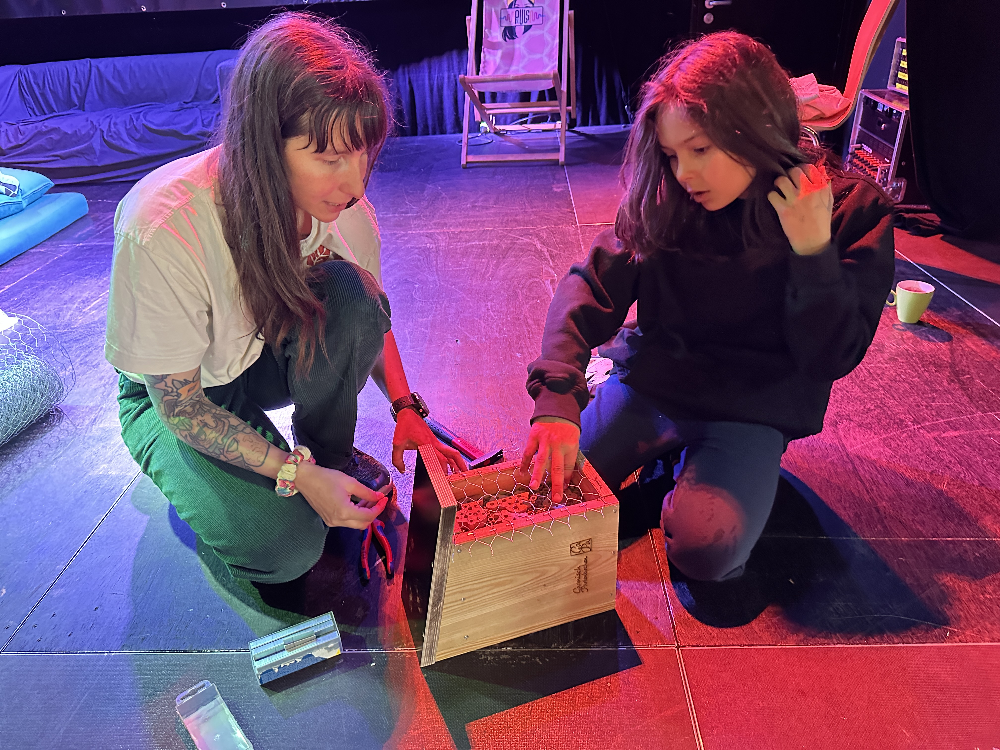

+++
title = "Insektenhotels befüllen für den Michael Ende Kurpark"
date = 2025-06-01
[taxonomies]
tags = ["Allgemein", "Umwelt", "Nachhaltigkeit", "Artenvielfalt"]
categories = ["Nachhaltigkeit & Ressourcen"]
klassen =["05. Klasse"]
+++

<!-- more -->

Auf Einladung von Sabine Schmeidl, der Leiterin unseres Garmisch-Partenkirchner Jugendzentrums „PULS“, durften die Schüler der Klasse 5g am 22. Mai 2025 zum Tag der Artenvielfalt Insektenhotels befüllen. Diese werden im Michael Ende Kurpark Garmisch aufgestellt. In einem Workshop erfuhren die jungen Leute viel über die wichtige Bedeutung der Insekten für unser Ökosystem, angefangen bei der Bestäubung bis hin zur Bodenbildung. Die Insektenhotels bieten unseren kleinen Helfern zusätzliche Lebensräume, die ihnen in ihrer natürlichen Umwelt teilweise verlorengehen. Eine leckere Brotzeit rundete den Schulvormittag kulinarisch ab. Vielen Dank Frau Schmeidl!
