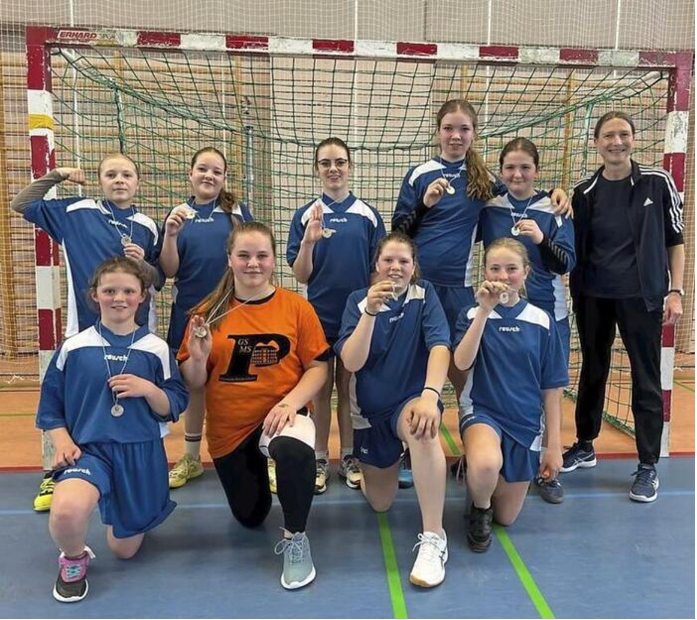
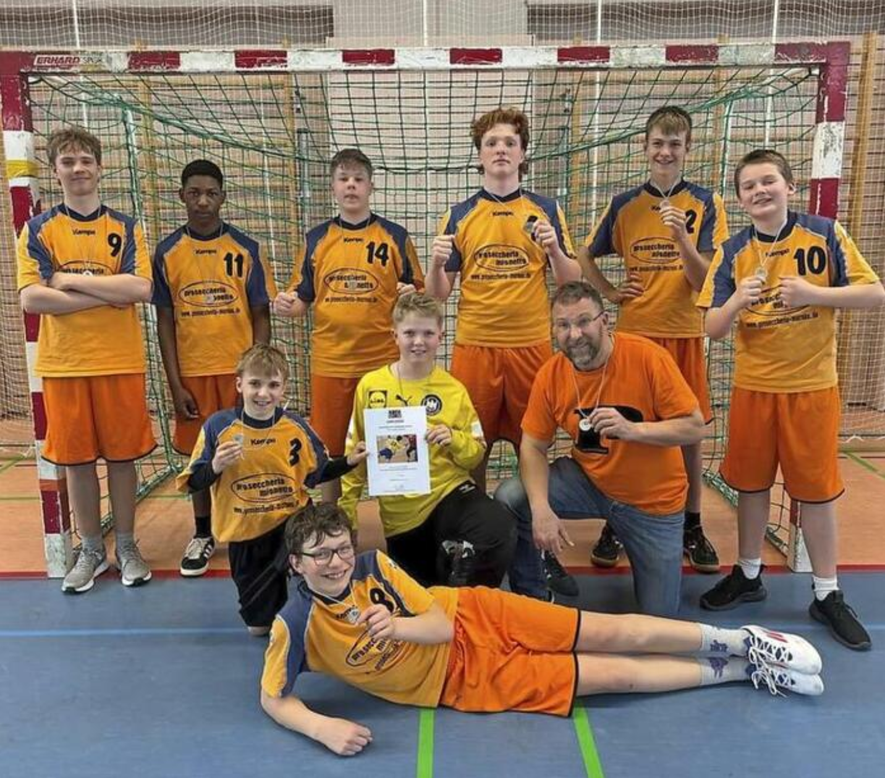

+++
title = "Stolzer Erfolg: Doppelt Silber für unsere Handball-Teams"
date = 2025-05-15
description = "Die Handball-Teams der Bürgermeister-Schütte-Mittelschule erringen bei der Oberbayerischen Meisterschaft jeweils den zweiten Platz"
[taxonomies]
tags = ["Allgemein", "Sport", "Schulsport", "Jugend", "Oberbayerische Meisterschaft"]
categories = ["Sport & Gesundheit"]
+++

# Doppelt Silber: Handball-Teams der Bürgermeister-Schütte-Mittelschule unterliegen Altötting

<!-- more -->

**Altötting** – Allein schon die Finaleinzüge sind als großer Erfolg zu werten. Da schmerzten die Niederlagen bei der Oberbayerischen Meisterschaft der Mittelschulen im Handball etwas weniger. Jeweils mussten sich die Buben und Mädchen (Jahrgang 2010 und jünger) der Bürgermeister-Schütte-Mittelschule den Talenten der Weiß-Ferdl-Mittelschule Altötting geschlagen geben. Doch als Vizemeister dürfen sich beide Teams betiteln. Die Mädchen sorgten mit diesem Erfolg für ein Novum, dass zurückzuführen ist auf die Handballabteilung des TSV Partenkirchen.

Für die Schüler ging es in Herrgottsfrühe los, stand doch eine 200 Kilometer lange Fahrt nach Altötting an. Dort wurden sie vom mehrmaligen Bezirksmeister in Empfang genommen, dem aber mächtig Paroli geboten wurde.

## Mädchen kämpften tapfer

Die Mädchen gingen gleich mal in Führung, mussten später aber ihrer Taktik Tribut zollen. Die Spielmacherinnen Klara Knon und Maria Schickl (Torhüterin beim TSVP) standen permanent auf dem Feld, im Verlauf der Partie verloren sie damit an Kraft und Konzentration. Nutzte Altötting, um zur Pause auf 12:8 zu stellen. Im zweiten Durchgang warfen die Garmisch-Partenkirchenerinnen alles rein, konnten den Abstand aber nicht mehr verringern und gratulierten ihren Gegnerinnen schlussendlich zum 20:15-Sieg.

## Jungenteam mit starkem Torhüter

Im Duell der Buben blieb es lange torlos, ganze neun Minuten dauerte es, ehe das erste Tor fiel. Die Werdenfelser hielten bis zum 4:5 aus ihrer Sicht gut mit, leisteten sich dann aber einige Fehlpässe, womit Altötting zur Pause auf 9:5 stellte. Dank Ignaz Knon, Jahrgang 2013, blieb es am Ende bei einer erträglichen 13:20-Niederlage für die Bürgermeister-Schütte-Schule. Der Torhüter stach mit einigen Glanzparaden aus dem Team hervor.

Dennoch zogen die Betreuer Kurt Christian und Andrea Stöcker ein positives Fazit. Zweimal Oberbayerischer Vizemeister, das kann sich sehen lassen.

---

*Quelle: Garmisch-Partenkirchner Tagblatt, 14. Mai 2025*
