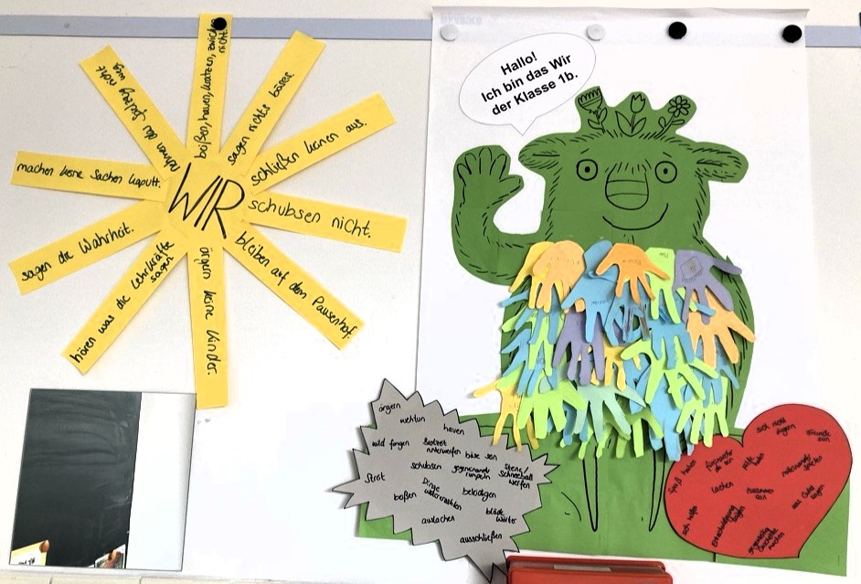

+++
title = "Ist das kleine WIR ganz verschwunden? Für immer?"
date = 2025-06-25
[taxonomies]
tags = ["Aktuelles", "Schulleben"]
categories = ["Jugendsozialarbeit an Schulen"]
+++

Die Aufregung in der Klasse 1b war groß als die Kinder von der Pause nach oben kamen und es so aussah, als sei ihr Klassen-WIR verschwunden. Es ist in den letzten Tagen offensichtlich nicht nur immer mehr geschrumpft und kleiner und kleiner geworden – es hat sich sogar hinter einem schwarzen Vorhang versteckt und im Klassenzimmer der 1b ist es ganz grau und dunkel geworden. Aber was genau ist eigentlich passiert?

<!-- more -->

Bereits vor einigen Monaten besuchte Elisabeth Grasegger, die Sozialpädagogin der Caritas (Jugendsozialarbeit an Schulen), die Erstklasskinder, um ihnen das „kleine WIR“ vorzustellen und mit den Kindern zu besprechen, wann das WIR groß und stark ist und wann es ihm nicht gut geht und es klein und unsichtbar wird. Wie es nun dazu kam, dass das gemeinsam gebastelte Klassen-WIR der 1b traurig wurde, wussten die Grundschüler*innen schnell: Das kleine WIR ist sicher erschrocken, weil es in der letzten Zeit in den Pausen ganz oft Streit gab. 
Zusammen überlegten die Kinder nun, was es braucht, damit in den Pausen die Sonne für das kleine WIR wieder scheint und es wieder glücklich und bunt werden kann. Damit es den Schüler*innen weiterhin gut gelingt, auf ihr WIR zu achten, kümmern sie jetzt auch jeden Tag gut darum und reflektieren, ob es heute froh und gut gelaunt aus der Pause zurückkommt oder ob es ihm schlecht geht und es sauer ist. 
Es ist toll wie sich alle Kinder auf die Suche nach ihrem Klassen-WIR gemacht und es auch wiedergefunden haben. So warten auf die Schüler*innen gewiss noch kunterbunte Tage, viel Spaß und Sonnenschein in den verbleibenden Wochen des Schuljahres 😊
