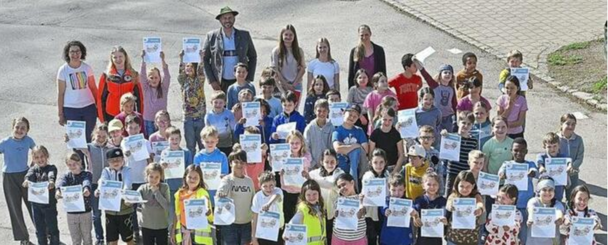

+++
title = "Drittklässler werden Juniorhelfer - Erste-Hilfe-Ausbildung erfolgreich abgeschlossen"
date = 2025-07-07
description = "Alle vier dritten Klassen der Bürgermeister-Schütte-Grundschule haben erfolgreich die Juniorhelferausbildung des Bayerischen Roten Kreuzes absolviert und helfen nun ihren Mitschülern in den Pausen"
template = "page.html"
[taxonomies]
tags = ["Aktuelles", "Erste Hilfe", "Juniorhelfer", "BRK", "Dritte Klasse"]
klassen = ["03. Klasse"]
+++

Eine besondere Auszeichnung für unsere Drittklässler: Alle vier dritten Klassen der Bürgermeister-Schütte-Grundschule haben erfolgreich die Juniorhelferausbildung des Bayerischen Roten Kreuzes (BRK) absolviert.

<!-- more -->

## Professionelle Ausbildung durch das BRK

Die Ausbildung wurde von Bernhard Bielitz und Antonia Schilling vom BRK geleitet. Ziel des Kurses war es, den Kindern neben theoretischem Wissen auch Sicherheit in praktischen Erste-Hilfe-Maßnahmen zu vermitteln. Finanziell unterstützt wurde diese wichtige Ausbildung vom Elternbeirat unserer Schule.

## Umfassende Erste-Hilfe-Inhalte

Die Schülerinnen und Schüler lernten verschiedene lebensrettende Techniken:

- Das richtige Anlegen von Verbänden
- Verhalten bei Bewusstlosigkeit inklusive stabiler Seitenlage
- Korrektes Absetzen eines Notrufs
- Herzdruckmassage an Reanimationspuppen

## Juniorhelfer im Einsatz

Nach erfolgreichem Abschluss erhielten die Mädchen und Buben ihre Urkunden und sind bereits als Juniorhelfer in den Schulpausen im Einsatz. Sie helfen ihren Mitschülern bei kleineren Verletzungen und tragen so zu einem sicheren Schulalltag bei.

## Dank an alle Beteiligten

Wir bedanken uns herzlich bei den BRK-Ausbildern Bernhard Bielitz und Antonia Schilling für die professionelle Durchführung des Kurses. Besonderer Dank gilt auch dem Elternbeirat unter Vorsitz von Wolfgang Buchweiser für die finanzielle Unterstützung sowie den betreuenden Lehrerinnen Alexandra Scherer, Jenny Herlinski und Franziska Wielander und unserer Sicherheitsbeauftragten Daniela Beckmann.

*Quelle: Garmisch-Partenkirchner Tagblatt, 07. Juli 2025*