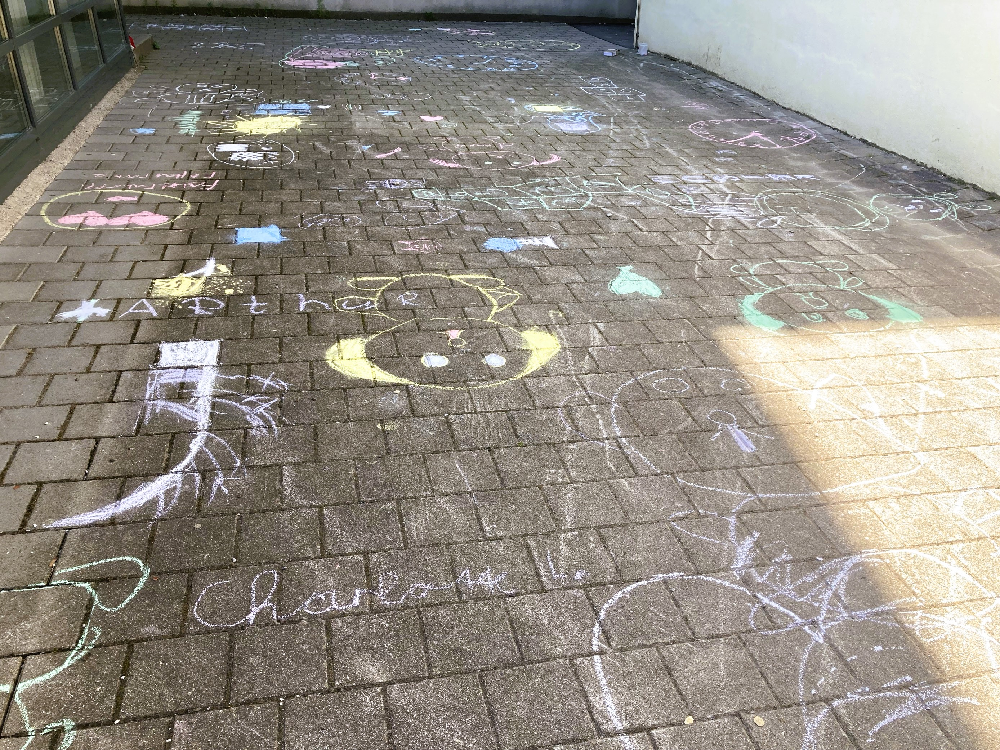

+++
title = "Lasst uns gemeinsam spielen!"
date = 2025-07-14
[taxonomies]
tags = ["Aktuelles", "Schulleben"]
categories = ["Jugendsozialarbeit an Schulen"]
+++

„Lasst uns gemeinsam spielen!“ – Mit diesem Impuls begrüßt Elisabeth Grasegger, die Jugendsozialarbeiterin an der Grundschule (Caritas) seit den Osterferien regelmäßig mittwochs in der 2. Pause diejenigen Kinder aus der Klasse 2d, die Lust haben bei dieser wöchentlich stattfindenden Pausenaktion der JaS dabei zu sein.

<!-- more -->

Nach einem ersten Kennenlernspiel zum Namen auffrischen durften die Schülerinnen und Schüler jede Woche auf’s Neue selbst entscheiden, wie sie ihre Pausen miteinander verbringen wollen und was sie zusammen spielen. Dabei wurden über die Zeit hinweg nicht nur verschiedenste Spielvorschläge gesammelt, sondern die Kinder durften auch ganz selbstwirksam das Spielgeschehen unter den Gleichaltrigen anmoderieren.
Neben ganz „klassischen“ Gruppenspielen wie „Kotzendes Känguru“, „Fischer, Fischer, welche Fahne weht heute?“ oder „Versteinern“, waren das Malen mit Straßenkreiden, das Gestalten von kunterbunten Steinen sowie das Teamspiel „Pipeline“ ganz besondere Highlights in den vergangenen Wochen. Das gemeinsame Spielen hat eine angenehme Pausenatmosphäre für die Kinder geschaffen und zu gelungenen Pausen beigetragen, indem wertvolle Erfahrungen und Erlebnisse im sozialen Miteinander ermöglicht wurden. Ein positives Klassenklima ist Voraussetzung für eine gute Lern- und Entwicklungsumgebung der Kinder. Deshalb unterstützte JaS die Klasse 2d mit sozialpädagogischen Maßnahmen, um ein gegenseitiges Verständnis für die individuellen Bedürfnisse einzelner Kinder sowie mehr Toleranz untereinander zu schaffen.
Hoffentlich hat es den Kindern der 2d genauso viel Spaß gemacht wie ihrer JaS-Fachkraft… 😊

