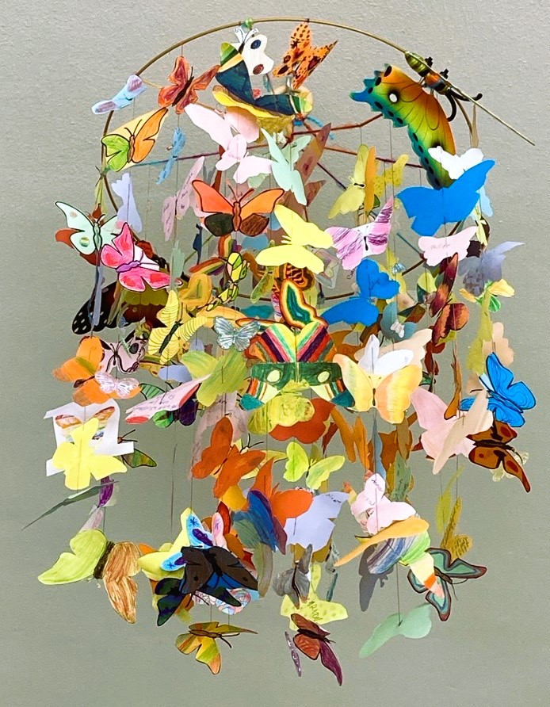

+++
title = "Ciao, Goodbye, Pfiad eich und Auf Wiedersehen"
date = 2025-07-22
[taxonomies]
tags = ["Aktuelles", "Schulleben"]
categories = ["Jugendsozialarbeit an Schulen"]
+++

Veränderung gehört zum Leben – wie ein Schmetterling, der von Blüte zu Blüte fliegt und irgendwann weiterzieht, um neue Horizonte zu entdecken. Mit dieser poetischen Metapher verabschiedet sich Elisabeth Grasegger, Sozialpädagogin M.A., nach fünf erfüllten Jahren als Jugendsozialarbeiterin (JaS) von der Bürgermeister-Schütte-Grundschule in Garmisch-Partenkirchen.

<!-- more -->

## Fünf Jahre voller Glücksmomente

In ihrem bewegenden Abschiedsbrief an Eltern und Schüler blickt Grasegger dankbar auf eine "kunterbunte, ereignisreiche" Zeit zurück. Als Jugendsozialarbeiterin der Caritas München sammelte sie über die Jahre hinweg unzählige kleine und große "Glücksmomente" und lernte "ganz tolle, mutige und bewundernswerte Kinder" kennen.

Besonders in Erinnerung bleiben werden ihr die vielfältigen Projekte und Aktionen in den Klassen sowie die Ausbildung der Drittklasskinder zu "Friedenshörnchen" – ein Programm, das Kinder zu Streitschlichtern und Friedensstiftern ausbildet.

## Die Schmetterlings-Metapher: Eine Lektion fürs Leben

Besonders berührend ist der Teil ihres Briefes, der sich direkt an die Grundschulkinder richtet. Mit der Metapher des Schmetterlings erklärt Grasegger den Kindern auf verständliche Weise, warum Veränderungen zum Leben gehören:

> "Auch wir Menschen verändern uns in unserem Leben immer wieder. Wir werden als Babys geboren, werden größer, besuchen irgendwann den Kindergarten und die Schule."

Sie ermutigt jedes Kind, sich als einzigartigen "kleinen, bunten Schmetterling" zu sehen, der durch die Welt fliegt – mit individuellen Talenten und Fähigkeiten, die es nur einmal gibt.

## Dankbarkeit und Vertrauen

Graseggers Abschied ist geprägt von tiefer Dankbarkeit gegenüber den Eltern für ihre "ehrlichen und offenen Gespräche" und das entgegengebrachte Vertrauen. Diese Zusammenarbeit zwischen Schule, Eltern und Jugendsozialarbeit bildet das Fundament für eine erfolgreiche Begleitung der Kinder.

Ihr Arbeitsplatz bei der Caritas in der Hindenburgstraße 10 war mehr als nur ein Büro – es war ein Ort der Begegnung, des Vertrauens und der Unterstützung für Kinder und Familien.

## Ein Neuanfang mit Herz

Wie ein Schmetterling, der neue Blüten entdecken möchte, wagt auch Elisabeth Grasegger den Schritt in ein neues berufliches Kapitel. Ihr Abschied ist kein Ende, sondern ein Aufbruch – mit einem lachenden und einem weinenden Auge, wie sie selbst sagt.

Bis zu den Sommerferien bleibt sie noch für "ihre" Schülerinnen und Schüler da, steht für Gespräche zur Verfügung und begleitet den Übergang. 

## Die Botschaft bleibt

Graseggers abschließende Worte an die Kinder werden noch lange nachhallen:

> "Lebe deine Träume. Sei du selbst. Denn du bist gut und genau so richtig, wie du bist."

Diese Botschaft der Selbstakzeptanz und Ermutigung ist das schönste Geschenk, das eine Jugendsozialarbeiterin ihren Schützlingen mit auf den Weg geben kann.

Die Bürgermeister-Schütte-Grundschule verliert eine engagierte Sozialpädagogin, die Kinder einen vertrauensvollen Ansprechpartner. Doch die Erinnerungen an fünf Jahre voller Begegnungen, Gespräche und gemeinsamer Projekte werden bleiben – bei Kindern, Eltern und Lehrern gleichermaßen.

*Wir wünschen Elisabeth Grasegger für ihren neuen Lebensabschnitt alles Gute und danken ihr für fünf Jahre wertvoller Arbeit mit Kindern und Familien in Garmisch-Partenkirchen.*

{{downloads(folder="downloads")}}