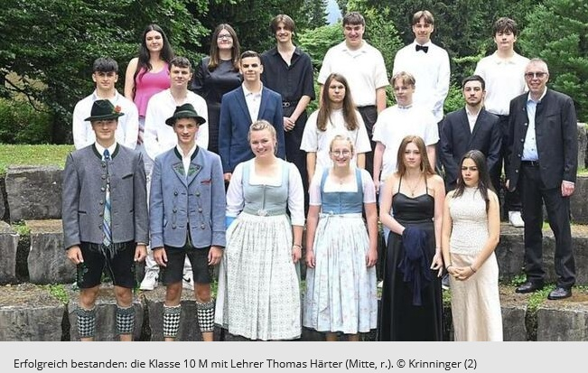

+++
title = "Erfolgreiche Schulabschlüsse im Landkreis Garmisch-Partenkirchen 2025"
date = 2025-07-30
description = "Ehrung der besten Mittelschüler und Abschlussfeier an der Bürgermeister-Schütte-Schule - Ein Rückblick auf die Schulabschlüsse 2025"
[taxonomies]
tags = ["Aktuelles", "Schulabschlüsse", "Ehrungen", "Presse"]
+++

Das Schuljahr 2024/25 im Landkreis Garmisch-Partenkirchen endete mit beeindruckenden Leistungen und emotionalen Abschiedsfeiern. Von der Ehrung der besten Absolventen bis hin zu berührenden Verabschiedungen langjähriger Lehrkräfte - die vergangenen Wochen standen ganz im Zeichen schulischer Erfolge und Neuanfänge.

<!-- more -->

## Landkreis ehrt seine besten Mittelschüler

In der Aula der Karwendel-Grund- und Mittelschule in Mittenwald fand am 25. Juli die feierliche Ehrung der besten Neuntklässler des Landkreises statt. Landrat Anton Speer (Freie Wähler) lobte die Absolventen: "Ihr verlasst die Schulen gut vorbereitet für eine spannende Zeit und habt mit euren Möglichkeiten bis hin zum Studium alle Weichen für die Zukunft gestellt."

### Die Spitzenleistungen im Überblick

**Eva Buchner** aus Uffing erzielte an der Christoph-Probst-Mittelschule Murnau mit der Note 1,0 den besten qualifizierenden Abschluss der Mittelschule. **Alejandra Nenekidis** aus Garmisch-Partenkirchen schloss ihren mittleren Bildungsabschluss an der Bürgermeister-Schütte-Schule mit der Note 1,4 ab.

Schulamtsdirektor Markus Köpf würdigte die Leistungen der Geehrten: "Ihr seid die Elite eurer Schulen. Durch die Erziehungspartnerschaft Eltern und Schule kann jeder nach dieser besten Schulausbildung seinen Berufswunsch einschlagen." Den Jugendlichen stehen im Herbst rund 300 Ausbildungsberufe zur Auswahl.

### Kiwanis-Gipfelstürmer Award für herausragendes Engagement

Eine besondere Ehrung erhielt **Moritz Kratz** aus Oberammergau. Der Kiwanis-Präsident Peter Bitzl zeichnete ihn mit dem Gipfelstürmer-Award 2025 für herausragendes ehrenamtliches, schulisches und gesellschaftliches Engagement aus. 

Klassenlehrer Sebastian Kramer zählte in seiner Laudatio auf, dass sich Moritz Kratz im Fußball-, Schützen- und Trachtenverein, als Klarinettist bei der Musikkapelle und bei der Bergwacht engagiert. "Habe nur sonntags frei", kommentierte der Preisträger selbst sein vielfältiges Engagement.

## Emotionale Abschlussfeier an der Bürgermeister-Schütte-Schule

Mit Beethovens "Freude schöner Götterfunken" verabschiedete die Bürgermeister-Schütte-Mittelschule am 26. Juli ihre 33 Absolventen im Kongresshaus. 14 Schülerinnen und Schüler erhielten den qualifizierenden Abschluss der Mittelschule, 19 Absolventen beschritten den M-Zug und haben nun die Mittlere Reife in der Tasche.

### "Schade, dass Ihr geht"

Da die Schüler kein eigenes Abschlussmotto hatten, dachte sich das Kollegium für sie eines aus: "Schade, dass Ihr geht." Rektorin Stefanie Schmidt betonte die besondere Gemeinschaft dieses Jahrgangs, die sich bei Fahrten nach Berlin, Amsterdam und Norwegen festigte.

"Ihr habt einen bedeutenden Meilenstein in Eurem Leben erreicht", sagte Schmidt. Besonders hob sie hervor, dass einige Schüler innerhalb kürzester Zeit Deutsch lernen mussten: "Genau solche jungen Erwachsenen brauchen wir in unserer Gesellschaft."

Die Vizebürgermeisterin Claudia Zolk (CSU) würdigte die Praxisnähe der Schule: "Ihr verlasst die Schule mit einem Koffer voller Lebenswerkzeug."

## Abschied einer Institution

Nach 40 Jahren Dienst verabschiedete sich **Angela Eitzenberger** von der Bürgermeister-Schütte-Schule in den vorgezogenen Ruhestand. Die katholische Religionslehrerin unterrichtete mit Leib und Seele alle Jahrgangsstufen. "Für mich war mein Beruf Berufung", blickt die 63-Jährige dankbar zurück.

Schulleiterin Stefanie Schmidt würdigte sie als "eine Institution", die man nur ungern ziehen lasse. Eitzenberger hinterlässt nicht nur selbstgestaltete Unterrichtsmaterialien, sondern auch eine Sammlung berührender Kinderbriefe: "Du bist die beste Lehrerin der Welt" oder "Bei Dir fühle ich mich mutig" zeugen von der besonderen Beziehung zu ihren Schülern.

---

Die Schulabschlüsse 2025 im Landkreis Garmisch-Partenkirchen stehen exemplarisch für erfolgreiche Bildungsarbeit, die sowohl fachliche Exzellenz als auch persönliche Entwicklung fördert. Mit Stolz können die Absolventen in ihre Zukunft blicken - sei es in der beruflichen Ausbildung oder auf weiterführenden Schulen.

{{downloads(folder="downloads")}}