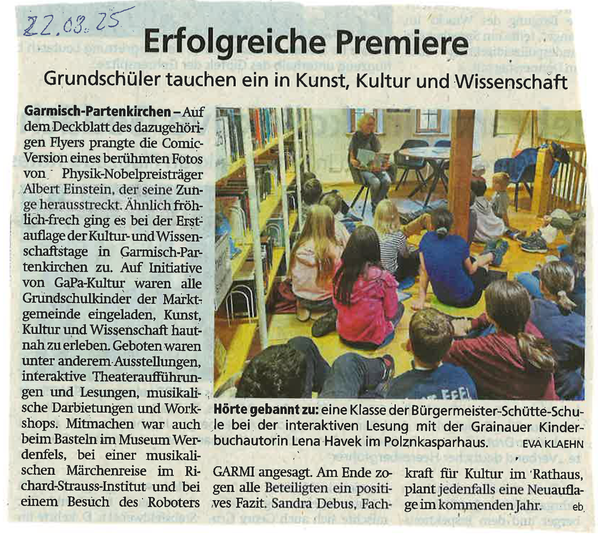

+++
title = "Erfolgreiche Premiere: Kultur- und Wissenschaftstage"
date = 2024-11-22
[taxonomies]
tags = ["Aktuelles", "Schulleben", "Kultur", "Projekte"]
categories = ["Kunst & Kultur"]
+++

# Erfolgreiche Premiere: Kultur- und Wissenschaftstage

Grundschüler tauchen ein in Kunst, Kultur und Wissenschaft – unter diesem Motto fanden zum ersten Mal die Kultur- und Wissenschaftstage in Garmisch-Partenkirchen statt. Auf Initiative von GaPa-Kultur waren alle Grundschulkinder der Marktgemeinde eingeladen, Kunst, Kultur und Wissenschaft hautnah zu erleben.

<!-- more -->

## Vielfältiges Programm

Das Deckblatt des Flyers zeigte passend zur Veranstaltung die Comic-Version eines berühmten Fotos von Physik-Nobelpreisträger Albert Einstein, der seine Zunge herausstreckt. Ähnlich fröhlich-frech ging es bei der Erstauflage der Kultur- und Wissenschaftstage zu.

Geboten waren unter anderem:
- Ausstellungen
- Interaktive Theateraufführungen und Lesungen
- Musikalische Darbietungen und Workshops
- Basteln im Museum Werdenfels
- Eine musikalische Märchenreise im Richard-Strauss-Institut
- Besuch eines Roboters

## Besonderes Highlight

Ein besonderes Erlebnis war die interaktive Lesung mit der Grainauer Kinderbuchautorin Lena Havek im Pollnkasparhaus, bei der die Schülerinnen und Schüler der Bürgermeister-Schütte-Schule gebannt zuhörten.

## Positive Bilanz und Ausblick

Am Ende zogen alle Beteiligten ein positives Fazit. Sandra Debus, Fachkraft für Kultur im Rathaus, plant jedenfalls eine Neuauflage im kommenden Jahr.

{{downloads(folder="downloads")}}