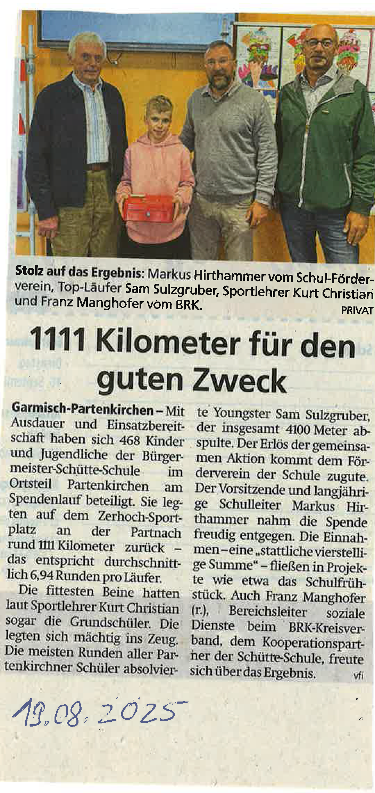

+++
title = "1111 Kilometer für den guten Zweck"
date = 2025-08-19
[taxonomies]
tags = ["Aktuelles", "Schulleben", "Sport", "Spendenlauf"]
+++

# 1111 Kilometer für den guten Zweck

Mit Sportgeist, Ausdauer und Einsatzbereitschaft haben sich 468 Kinder und Jugendliche der Bürgermeister-Schütte-Schule im Ortsteil Partenkirchen am Spendenlauf beteiligt. Sie legten auf dem Partnach-Sportplatz gemeinsam insgesamt 1111 Kilometer zurück – das entspricht durchschnittlich 2,4 Runden pro Läufer.

## Beeindruckende Leistungen

Die fittesten Beine hatten laut Sportlehrer Kurt Christian Loser die Grundschüler. Sie legten sich mächtig ins Zeug und zeigten großen Ehrgeiz. Die meisten Runden aller Partenkirchner Schüler absolvierte Sam Sulzgruber mit beeindruckenden 49 Runden – das sind etwa 14.700 Meter.

<!-- more -->

## Erfolgreiche Spendenaktion

Die Schülerinnen und Schüler liefen für einen guten Zweck: Die Einnahmen – eine "stattliche Summe" von 8.500 Euro – kommen in Projekte und Angebote des Fördervereins der Schule.

## Große Freude bei den Organisatoren

Der Vorsitzende und langjährige Leiter des Fördervereins, Markus Hirthammer, zeigte sich sehr erfreut über das Engagement der Schülerinnen und Schüler. Auch Franz Manghofer vom Bayerischen Roten Kreuz und Kurt Christian Loser als Sportlehrer waren stolz auf die Leistung der Kinder und Jugendlichen.

{{downloads(folder="downloads")}}