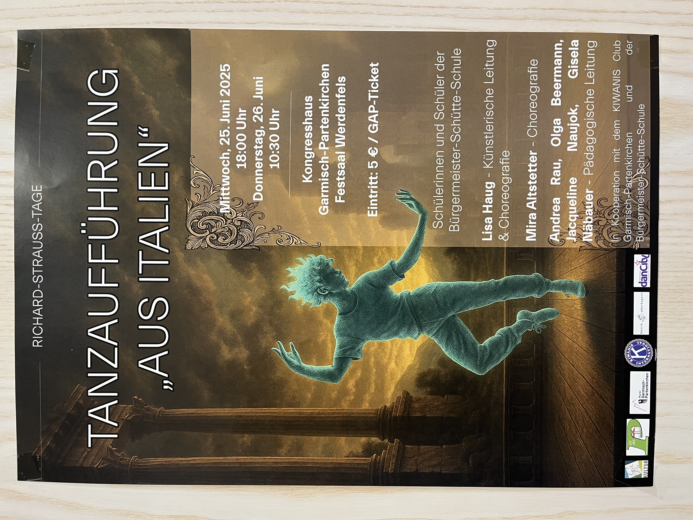

+++
title = "Richard-Strauss-Tage: Tanzaufführung 'Aus Italien' begeisterte das Publikum"
date = 2025-06-27
draft = false
author = "Redaktion"
tags = ["Richard-Strauss-Tage", "Tanz", "Kultur"]
categories = ["Kunst & Kultur"]
description = "Schülerinnen und Schüler der Bürgermeister-Schütte-Schule brachten Richard Strauss' symphonische Fantasie 'Aus Italien' als beeindruckende Tanzaufführung auf die Bühne."
+++

# Richard-Strauss-Tage in Garmisch-Partenkirchen: Wenn junge Tänzer Italien zum Leben erwecken

## Eine besondere Hommage an Richard Strauss' symphonische Fantasie

Die Richard-Strauss-Tage in Garmisch-Partenkirchen warteten mit einem besonderen Höhepunkt auf: Schülerinnen und Schüler der Bürgermeister-Schütte-Schule brachten Richard Strauss' symphonische Fantasie "Aus Italien" als eindrucksvolle Tanzaufführung auf die Bühne und begeisterten damit das Publikum im Festsaal Werdenfels.

<!-- more -->

### Die Aufführungen im Rückblick

An zwei Terminen - am **Mittwoch, 25. Juni 2025** um 18:00 Uhr und am **Donnerstag, 26. Juni 2025** um 10:30 Uhr - verwandelte sich der Festsaal Werdenfels im Kongresshaus Garmisch-Partenkirchen in eine Bühne für zeitgenössischen Tanz. Die jungen Tänzerinnen und Tänzer zeigten, wie lebendig klassische Musik interpretiert werden kann.

### Ein ambitioniertes Projekt mit beeindruckendem Ergebnis

Unter der künstlerischen Leitung und Choreografie von **Lisa Haug** sowie der Choreografie von **Mira Altstetter** hatten die jungen Tänzerinnen und Tänzer eine einzigartige Interpretation von Strauss' Werk erarbeitet. Die pädagogische Leitung lag in den bewährten Händen von Andrea Rau, Olga Beermann, Jacqueline Naujok und Gisela Nabauer.

Das Besondere an diesem Projekt: Es verband klassische Musik mit zeitgenössischem Tanz und brachte den Schülern die Welt der symphonischen Dichtung auf eine ganz neue, körperliche Art näher. Das Engagement und die Leidenschaft der jungen Künstler waren in jeder Bewegung spürbar.

### "Aus Italien" – Eine musikalische Reise wurde zum Tanz

Richard Strauss komponierte seine symphonische Fantasie "Aus Italien" als junger Mann nach einer Reise durch das sonnige Italien. Die Musik fängt die Stimmungen, Landschaften und Eindrücke dieser Reise ein – von der Campagna über die Ruinen Roms bis zum neapolitanischen Volksleben.

Die Tanzaufführung übersetzte diese musikalischen Bilder eindrucksvoll in Bewegung und bot dem Publikum ein visuelles und emotionales Erlebnis, das die Musik von Richard Strauss auf neue Weise erfahrbar machte. Die jungen Tänzer erweckten die italienische Atmosphäre durch ihre ausdrucksstarke Performance zum Leben.

### Eine erfolgreiche Kooperation

Das Projekt entstand in Kooperation mit dem KIWANIS Club Garmisch-Partenkirchen und der Bürgermeister-Schütte-Schule. Diese Zusammenarbeit zwischen schulischer Bildung und kulturellem Engagement zeigte eindrucksvoll, wie wichtig die Förderung junger Talente und die Vermittlung klassischer Musik an die nächste Generation ist.

Mit einem Eintrittspreis von nur 5 € (GAP-Ticket) war die Veranstaltung für ein breites Publikum zugänglich und trug so zur kulturellen Teilhabe bei.

### Was diese Aufführung besonders machte

1. **Authentischer Ort:** Die Richard-Strauss-Tage fanden in der Heimatstadt des Komponisten statt
2. **Junge Perspektive:** Schüler interpretierten ein klassisches Werk neu und frisch
3. **Interdisziplinärer Ansatz:** Die Verbindung von Musik und Tanz schuf ein beeindruckendes Gesamtkunstwerk
4. **Zugänglichkeit:** Mit 5 € Eintritt war die Veranstaltung für jeden erschwinglich
5. **Professionelle Umsetzung:** Trotz des jungen Alters der Künstler war die Qualität der Darbietung außergewöhnlich

### Stimmen zur Aufführung

Die beiden Vorstellungen wurden vom Publikum begeistert aufgenommen. Besonders hervorgehoben wurde die Ausdruckskraft der jungen Tänzer und die kreative Umsetzung der musikalischen Vorlage. Der Festsaal Werdenfels im Kongresshaus bot dabei eine würdige und atmosphärische Kulisse für diese besondere Aufführung.

### Fazit

Diese Tanzaufführung war mehr als nur eine Schulveranstaltung – sie war ein bedeutender Beitrag zur lebendigen Kulturlandschaft Garmisch-Partenkirchens und zeigte eindrucksvoll, wie klassische Musik auch heute noch junge Menschen begeistern und inspirieren kann. Die Verbindung von Richard Strauss' musikalischer Vision Italiens mit der körperlichen Ausdruckskraft des Tanzes bot ein unvergessliches Erlebnis.

Das Projekt bewies einmal mehr, dass die Förderung junger Talente und die zeitgemäße Vermittlung klassischer Musik wichtige Bausteine für eine lebendige Kulturlandschaft sind. Die Richard-Strauss-Tage in Garmisch-Partenkirchen bieten Jahr für Jahr eine Plattform für solche innovativen Projekte und halten damit das Erbe des großen Komponisten lebendig.

---

*Die Richard-Strauss-Tage sind ein jährlich stattfindendes Festival, das dem berühmtesten Sohn der Stadt gewidmet ist und Musikliebhaber aus aller Welt anzieht. Die nächsten Richard-Strauss-Tage finden voraussichtlich im Juni 2026 statt.*