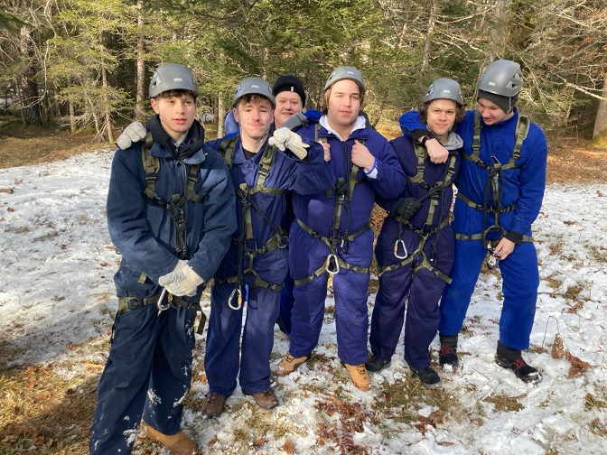

+++
title = "Bürgermeister-Schütte-Schule zu Besuch bei der Bundeswehr"
date = 2026-02-14
description = "Die Abschlussklassen besuchten den Bundeswehrstandort in Mittenwald und erlebten einen spannenden Tag mit Parcours, Klettergelände und Einblicken in den Berufsalltag der Soldaten"

[taxonomies]
tags = ["Aktuelles", "Bundeswehr", "Exkursion", "Abschlussklassen", "Mittenwald", "Berufsorientierung"]
categories = ["Berufsorientierung"]
+++

Am 27.01.2026 besuchten die Abschlussklassen den Bundeswehrstandort in Mittenwald. Am Morgen sind wir mit dem Bus losgefahren. Nach unserer Ankunft wurden wir freundlich empfangen und durften uns einen Vortrag von verschiedenen Soldaten und Angehörigen der Bundeswehr anhören. Dort erfuhren wir viel über die Aufgaben der Bundeswehr und die verschiedenen Ausbildungsmöglichkeiten. Der Vortrag war sehr informativ und hat uns einen guten Einblick ins Berufsfeld gegeben.

<!-- more -->

## Sportparcours und Verpflegung

Anschließend absolvierten wir einen Parcours, der für die sportliche Ertüchtigung der Soldaten da ist. Dieser war zwar sehr anstrengend, hat aber gleichzeitig auch viel Spaß gemacht. Dort konnten wir unsere Ausdauer und unseren Ehrgeiz beweisen.

Zwischendurch wurden wir auch bestens verpflegt. Es gab eine Vorspeise, ein Hauptgericht mit Salat, sowie Getränke und eine Nachspeise. Das Essen war sehr lecker und hat uns für die nächste Aktivität gestärkt.

## Kletterabenteuer im Gelände

Nach dem Essen fuhren wir mit dem Bus weiter zu einem Klettergelände. Dort bekamen wir Klettergurte und Helme angezogen. Besonders aufregend war es auf dem Bauch über ein Seil eine Schlucht zu überqueren. Danach ging es über einen Klettersteig wieder zurück. Diese Erfahrung war für viele von uns das Highlight.

## Einblick in Technik und Waffen

Außerdem besichtigten wir die Garage, in der die Fahrzeuge der Bundeswehr repariert werden, und den Raum in welchem die Waffen repariert, gesäubert und kontrolliert werden. Einige durften sogar eine Waffe in die Hand nehmen, das war sehr aufregend.

Insgesamt war es ein sehr spannender, abwechslungsreicher und erlebnisreicher Tag, der uns sicher noch lange in Erinnerung bleibt.

---

*Elena Burger, 10Ma*
